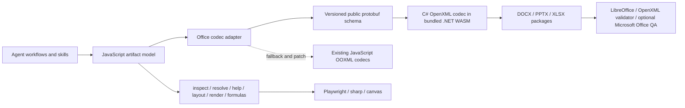

# Reference runtime architecture and clean-room direction

- Status: accepted direction, implementation pending
- Evidence snapshot: 2026-07-13
- Reference package: `office-artifact-tool@2.8.22`
- Reference runtime asset package: `@officer/walnut@0.1.210`

## Decision

The long-term Office I/O path for `open-office-artifact-tool` should be a bundled, clean-room .NET WebAssembly codec built with the public Microsoft Open XML SDK. JavaScript remains the agent-facing product layer. The existing Microsoft Office COM sidecar remains an optional renderer and compatibility oracle; it is not the core DOCX/PPTX/XLSX codec.

The target split is:

- JavaScript: artifact models, editing facades, formulas, inspect/resolve/help, layout, preview rendering, workflow orchestration, codec selection, and bounded input preflight.
- C# in bundled .NET WebAssembly: typed OPC/Open XML package reading and writing for DOCX, PPTX, and XLSX, package relationship/content-type handling, format-version validation, and preservation of package data that is outside the semantic model.
- A versioned public wire schema: independently designed messages shared by JavaScript and C#. The schema is an implementation boundary, not a clone of the reference runtime's private protobuf contract.
- Playwright/Skia/sharp/canvas: model preview and raster rendering.
- LibreOffice, Poppler, Open XML SDK validation, and optional Microsoft Office automation: render-backed and application-compatibility QA.
- PDF.js and the clean-room PDF implementation: PDF parsing/writing. The observed reference package does not expose a PDF model or PDF codec from its main module.

The existing JavaScript OOXML codecs remain useful as a fallback, a patch/inspection layer, a test oracle, and a migration safety net. They should not be deleted before the WebAssembly path proves equal or better behavior fixture by fixture.

## Clean-room boundary

This study used only observable and redistributable package facts:

- package manifests and file names;
- runtime boot metadata;
- public ESM exports and public object methods;
- public `.NET WebAssembly` assembly export names;
- shipped README, skills, and smoke tests;
- black-box calls using generated empty artifacts and byte counts.

It did not decompile, disassemble, copy, or translate the reference JavaScript bundle, the `Walnut` assembly, its WebAssembly binaries, native bindings, method bodies, or protobuf implementation. No reference runtime artifact may be copied into this project.

## Package evidence

The checked-out reference submodule is `e6dd700a79dae65ea53b0e775fa72ef6b8cc5376`. Its package manifest declares two bundled runtime dependencies:

- `@officer/walnut@0.1.210`
- `skia-canvas@^3.0.6`

Approximate installed footprint from `du -sk`:

| Area | KiB | Role |
| --- | ---: | --- |
| `dist/` | 10,880 | Compiled ESM product/model/formula/layout layer |
| `node_modules/@officer/walnut` | 12,624 | .NET WebAssembly Open XML codec runtime |
| `node_modules/skia-canvas` | 22,108 | Native text/raster canvas runtime |
| `skills/` | 6,460 | Agent instructions, scripts, templates, and QA workflows |

The main `dist/artifact_tool.mjs` file is 11,118,246 bytes. Public reflection found 1,163 ESM exports, including approximately 498 all-uppercase spreadsheet formula functions and 59 exports whose names explicitly mention proto conversion. These counts are inventory evidence, not a compatibility promise.

Node process-report evidence also shows that importing the main ESM module loads `skia-canvas/lib/skia.node` into the process. Skia is therefore a separate native text/raster dependency, not part of the C# Office codec. This project does not need to copy that eager-loading choice: renderer dependencies should remain optional or lazy so Office model and codec use does not fail on an unsupported native canvas build.

The public model surface shows substantial JavaScript ownership:

- `Workbook`: model collections, formulas/recalculation, trace, inspect/help/resolve/apply, collaboration, render, HTML, image, and export behavior, plus `toProto()`.
- `Presentation`: compose, model collections, inspect/help/resolve/apply, collaboration, render context, `toProto()`, `toPresentationBytes()`, and `toArtifactBundle()`.
- `DocumentModel`: document model/layout/export behavior, `toProto()`, and `toDocumentBytes()`.
- `SpreadsheetFile`, `PresentationFile`, and `DocumentFile`: the public Office file import/export facades.

The public `toProto()` methods return plain JavaScript objects. Top-level examples include workbook sheets/styles/theme/pivot caches, presentation slides/layouts/charts/images/theme, and document elements/sections/styles/comments/notes. `Presentation.toArtifactBundle()` returns an object with `rootArtifactId` and `artifacts`, indicating a second, package-oriented preservation path alongside the semantic presentation message.

## .NET WebAssembly evidence

`@officer/walnut` exposes runtime assets rather than a conventional JavaScript API. Its `blazor.boot.json` reports:

- `mainAssemblyName: "Walnut"`;
- 31 `.wasm` files in the runtime directory;
- `linkerEnabled: true`;
- `globalizationMode: "invariant"`.

The boot resource graph contains:

- `Walnut` at about 2.8 MiB;
- `DocumentFormat.OpenXml` at about 4.2 MiB;
- `DocumentFormat.OpenXml.Framework` at about 276 KiB;
- `Google.Protobuf` at about 312 KiB;
- `System.IO.Packaging`, `System.IO.Compression`, XML, collections, and other .NET assemblies;
- the .NET native/runtime JavaScript and WebAssembly host files.

The separate `DocumentFormat.OpenXml.Framework` and typed `DocumentFormat.OpenXml` resources strongly indicate Open XML SDK 3.x or later, because Microsoft split the framework package starting with 3.0. The exact reference version is not proven by the package metadata and is not required for the clean-room implementation.

Loading the runtime with its standard `dotnet.js` host and calling `getAssemblyExports("Walnut")` exposes only six codec classes and eight canonical methods:

| .NET export class | Method | Observed JS arity | Boundary |
| --- | --- | ---: | --- |
| `DocxReader` | `ExtractDocxProto` | 2 | DOCX bytes to document message bytes |
| `DocxExport` | `ExportProtoToDocx` | 1 | Document message bytes to DOCX bytes |
| `PptxReader` | `ExtractSlidesProto` | 2 | PPTX bytes to presentation message bytes |
| `PptxReader` | `ExtractPresentationArtifactBundle` | 2 | PPTX bytes to package-preserving bundle bytes |
| `PptxExport` | `ExportProtoToPptx` | 1 | Presentation message bytes to PPTX bytes |
| `PptxExport` | `ExportArtifactBundleToPptx` | 1 | Bundle bytes to PPTX bytes |
| `XlsxReader` | `ExtractXlsxProto` | 2 | XLSX bytes to workbook message bytes |
| `XlsxExport` | `ExportProtoToXlsx` | 1 | Workbook message bytes to XLSX bytes |

The second reader argument is optional in the observed empty-file calls. Its precise private meaning was not investigated because it is not necessary to establish the architecture and is outside the clean-room target.

## Black-box boundary proof

Direct public export calls were exercised with empty clean-room model objects. Only byte types, lengths, ZIP signatures, and roundtrip success were recorded.

| Format | Input/package bytes | Message bytes | Re-export bytes | Result |
| --- | ---: | ---: | ---: | --- |
| XLSX | 3,315 | 980 | 3,312 | Returned a valid ZIP/OOXML package |
| PPTX | n/a | 2,477 authored message | 7,668 | Returned a valid ZIP/OOXML package; extracted message was 3,581 bytes |
| DOCX | n/a | 2,086 authored message | 3,973 | Returned a valid ZIP/OOXML package; extracted message was 2,169 bytes |

For the same empty PPTX, the core presentation extraction returned 3,581 bytes and the artifact-bundle extraction returned 3,629 bytes. Both corresponding exporters produced valid OOXML ZIP packages. This proves a dual PPTX I/O contract without requiring knowledge of the private message fields.

Instrumenting only public JavaScript methods during normal file export observed calls to `Workbook.toProto()`, `Presentation.toProto()` plus `toPresentationBytes()`, and `DocumentModel.toProto()` plus `toDocumentBytes()`. This confirms that JavaScript owns model-to-message conversion while the .NET layer consumes serialized bytes.

The runtime also loaded successfully under Node with `PATH=/usr/bin:/bin`, where the Homebrew `dotnet` CLI was not visible, and still exposed all six codec classes. The SDK is required to build the assets, but end users receive and execute the published `dotnet.js`, runtime WebAssembly, and managed assemblies from npm.

One local timing sample measured about 1,058 ms for the large main-module import, 1 ms for an empty presentation model creation, 320 ms for the first PPTX export, and 20 ms for a second export in the same process. These machine-specific numbers are not a performance contract, but the warm-call difference is consistent with a cached runtime/codec instance and supports the requirement to initialize once per process.

## What the Open XML SDK contributes

The Microsoft Open XML SDK provides strongly typed package, part, relationship, and schema element APIs for WordprocessingML, PresentationML, and SpreadsheetML. It removes a large class of hand-maintained namespace, schema-order, relationship, content-type, and package-ownership errors. It also provides validation against Office format versions.

It does not provide the high-level agent artifact model, spreadsheet calculation engine, layout engine, presentation compose system, renderer, or application-equivalent pagination. The official project explicitly describes the SDK as a low-level Open XML/OPC API rather than a high-level productivity abstraction. The reference package's large JavaScript surface is consistent with that division.

Primary public references:

- [Microsoft Open XML SDK getting started](https://learn.microsoft.com/en-us/office/open-xml/getting-started)
- [Microsoft Open XML SDK repository and MIT license](https://github.com/dotnet/Open-XML-SDK)
- [.NET WebAssembly browser/Node application templates and JS interop](https://learn.microsoft.com/en-us/aspnet/core/client-side/dotnet-interop/wasm-browser-app)
- [Protocol Buffers C# generated code guide](https://protobuf.dev/reference/csharp/csharp-generated/)

## Current project gap

Current source inventory:

- JavaScript source under `src/`: 23,698 committed lines.
- `src/index.mjs`: 12,675 lines, about 53.5% of JavaScript source.
- C# under `native/`: 490 lines.
- Core dependency for Office packages: `jszip`.
- C# package references for Open XML: none.

All current DOCX/PPTX/XLSX semantic import/export work therefore runs through the JavaScript package layer. The C# `OfficeBridge` is a separate JSON stdin/stdout process that uses late-bound Microsoft Office COM automation on Windows for render/convert/application operations.

This means the project has built valuable product-layer behavior but is missing the reference architecture's core Office codec boundary. Continuing indefinitely with JavaScript-only OOXML feature patches would duplicate more of the package/part/schema work already provided by the public Open XML SDK.

## Target architecture

### JavaScript owns

- stable agent-facing IDs and public object facades;
- editing and composition semantics;
- spreadsheet calculation, dependency graphs, and formula help;
- inspect, resolve, help, verify, layout, and preview APIs;
- renderer selection and visual QA;
- conversion between the public JS model and the project's own wire schema;
- codec policy such as `wasm`, `js`, or controlled fallback;
- input preflight, output limits, timeouts, and structured errors.

### C# OpenXML-WASM owns

- opening and creating WordprocessingDocument, PresentationDocument, and SpreadsheetDocument packages from bounded byte streams;
- typed part, content-type, relationship, and schema element handling;
- semantic extraction into the project's public messages;
- semantic export from those messages;
- preservation of package parts and relationships not represented by the editable model;
- Open XML format-version validation and structured diagnostic records;
- codec-local part/count/byte/depth budgets.

It must not own agent IDs, workflow policy, formula evaluation, layout, raster rendering, or network access.

### Native Office automation owns

- optional Word/Excel/PowerPoint application render and conversion;
- recalculation, field update, and application-specific compatibility checks that Open XML alone cannot prove;
- Windows-only baselines.

It remains outside the default import/export path and outside the required npm runtime.

## Independent wire contract

The repository should publish its own `.proto` sources and generated C#/JavaScript bindings. The initial contract should include:

- a protocol version and artifact family;
- the semantic document/presentation/workbook payload;
- stable model IDs that are explicitly distinct from native OOXML IDs;
- binary assets with media type, digest, and bounded bytes;
- source-package identities needed for loss-aware editing;
- an opaque package graph for unsupported parts, internal/external relationships, and content types;
- import/export diagnostics and unsupported-feature records;
- deterministic unknown-field and version-skew behavior.

The opaque graph is essential. The reference runtime's separate PPTX artifact-bundle path is observable evidence that a semantic message alone is insufficient for high-fidelity third-party roundtrips.

The schema must be designed from this project's public model, ECMA-376/ISO 29500, OPC, and Open XML SDK types. It must not reuse reference field numbers, message names, binary fixtures, or generated code.

## Runtime packaging requirements

- Build assets from checked-in C# and `.proto` sources in CI.
- Bundle the published `dotnet.js`, native runtime WebAssembly, managed assemblies, boot manifest, and integrity metadata in the npm tarball.
- Load the runtime lazily on the first DOCX/PPTX/XLSX codec call and cache one initialized runtime per process.
- Require no end-user .NET SDK, Microsoft Office, LibreOffice, or network access for normal Office import/export.
- Keep build-time SDK/workload requirements separate from runtime requirements.
- Record all NuGet/runtime licenses in `THIRD_PARTY_NOTICES.md`, generate an SBOM, and fail package tests if required runtime assets are absent.
- Pin reproducible .NET, Open XML SDK, and protobuf versions.
- Do not ship symbols, source maps, debug files, or reference-package assets unless deliberately licensed and required.

The installed machine currently has .NET SDK 8.0.128 but no WebAssembly workload. Microsoft documents the `wasmconsole` Node/V8 template through the `wasm-experimental` workload; the .NET 8 JS interop APIs themselves are supported even though the standalone templates' developer workflow remains experimental. The first implementation milestone must pin and install the chosen workload in CI rather than relying on global machine state.

## Migration plan

1. Add a source-built `native/OpenXmlWasm` scaffold and a minimal versioned schema.
2. Prove one end-to-end XLSX vertical slice: JS model to message bytes to C# Open XML SDK to XLSX, then back to the JS model.
3. Package the runtime and run the installed tarball with `dotnet` removed from runtime `PATH`.
4. Exercise the existing spreadsheet formula-summary and arbitrary-path fixtures through both `wasm` and `js` codecs. Compare semantic inspect output, modeled verification, Open XML validation, and native render pages.
5. Add loss-aware opaque package preservation and third-party XLSX corpus roundtrips.
6. Extend the same shared runtime/schema/package graph to DOCX and PPTX. Use the PPTX bundle design from the start rather than postponing native-object preservation.
7. Make WebAssembly the default only after compatibility and failure-mode gates pass. Retain an explicit JavaScript fallback until the migration matrix is complete.
8. Keep PDF and render adapters on their existing independent paths.

## First vertical-slice acceptance criteria

The first WebAssembly milestone is not complete until all of these are true:

- every runtime artifact is built from this repository and public dependencies;
- the npm tarball contains all required runtime files and no reference runtime files;
- a clean temporary npm install imports and exports a real XLSX under Node without a local .NET SDK;
- JavaScript and WebAssembly codec modes roundtrip the same public workbook fixture;
- the generated XLSX passes package inspection and Open XML SDK validation with zero errors;
- the imported workbook passes inspect/resolve/verify and runnable spreadsheet skill gates;
- LibreOffice/Poppler render-backed output passes when those QA tools are installed;
- malformed and oversized input produces bounded structured errors in both JavaScript and C#;
- runtime initialization is lazy, cached, and concurrency-tested;
- `npm test`, generated API docs, package dry-run, C# tests, WebAssembly build tests, and hosted CI pass.

## Explicit non-goals

- Reimplementing the reference `Walnut` assembly or matching its private protobuf binary schema.
- Moving formulas, agent APIs, layout, rendering, or collaboration wholesale into C#.
- Requiring Microsoft Office, Windows, LibreOffice, or a local .NET SDK for normal package I/O.
- Treating Open XML validation as proof of application rendering fidelity.
- Deleting working JavaScript codecs before the WebAssembly replacement is proven.
