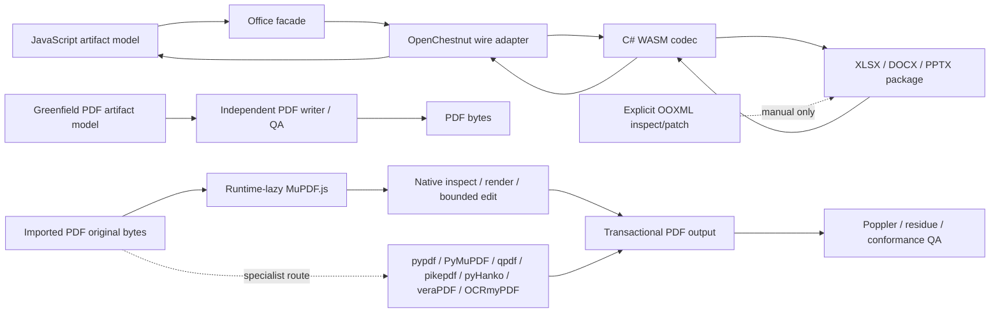

# Runtime architecture

## Decision

OpenChestnut is the only XLSX, DOCX, and PPTX codec. It is implemented in C# with the Open XML SDK and compiled into the bundled .NET WebAssembly runtime. PDF remains an independent implementation.

Version 0.2 intentionally has no Office codec registry, selector, compatibility shim, or fallback path.



## Responsibilities

### JavaScript

JavaScript owns:

- public Workbook, DocumentModel, Presentation, and PDF object models;
- formula calculation and other model-side computation;
- presentation Compose/JSX;
- validation, normalization, inspect, resolve, layout, render orchestration, and QA;
- the OpenChestnut wire adapter and generated protocol binding;
- explicit, low-level OOXML package inspect/patch helpers;
- JSZip where package inspection/patching needs it;
- the independent PDF pipeline and optional adapters.

JavaScript does not serialize or parse DOCX, XLSX, or PPTX for the normal file facades.

### OpenChestnut C# WASM

OpenChestnut owns:

- OPC package validation and safe path/relationship/content-type handling;
- DOCX, XLSX, and PPTX semantic import/export;
- source snapshot and opaque-object preservation checks;
- bounded source-bound edits;
- deterministic package generation within the supported profiles.

The implementation uses the Open XML SDK because its strongly typed package and schema model provides a broad, shared foundation across WordprocessingML, SpreadsheetML, and PresentationML. C# is not exposed as a second user model; the wire is the boundary between JavaScript artifacts and native OOXML operations.

### PDF

PDF never enters the Office codec request, has no Office protobuf payload, and does not load the C# runtime. The project does not create `OpenChestnut.Pdf` or maintain a general C# PDF parser/writer.

The JavaScript `PdfArtifact`/`PdfFile` domain owns greenfield semantic/tagged authoring, trusted-model roundtrip, reading order, accessibility metadata, inspect/verify, and modeled render QA. The required `mupdf@1.28.0` dependency is loaded only when a PDF operation needs it; arbitrary PDFs use MuPDF.js by default for native parsing, structured-text/image/link evidence, inspection, raster rendering, and bounded direct-original edits. PDF.js remains an optional reconstructed read/inspect adapter, never an edit representation.

The native PDF Skill calls the same `PdfFile` MuPDF.js primitives through a thin JavaScript CLI. Python and system adapters remain for strict scrub/residue, typed pypdf workflows, qpdf repair/linearization, pikepdf fixed-profile structure cleanup, veraPDF conformance, and OCRmyPDF searchable-layer generation. Two pyHanko 0.35.x boundaries are shipped over one separately installed core runtime: `pyhanko_sign_provider.py` inventories a private exact-source snapshot and adds one local-PKCS#12 approval or first-document certification signature under explicit field, count, credential, DocMDP, byte/time/output, trust/isolation, exact-prefix, and no-replace constraints; `pyhanko_provider.py` independently validates immutable final bytes under caller-supplied roots and reports integrity, trust, revision coverage, difference level, timestamps, DocMDP, FieldMDP, and policy gates. Passphrases enter only on stdin, signing never establishes certificate trust, and TSA/LTV/DSS, PKCS#11/HSM, remote signing, online retrieval, and complete PAdES conformance remain external. Poppler remains independent final render QA.

The router has no silent fallback. Mutation records source hashes and uses a distinct transactional output plus one explicit strategy: `rewrite`, byte-prefix-preserving `incremental`, or destructive `sanitize`. Signature/DocMDP evidence is checked first. High-trust redaction applies real redactions, scrubs, fully rewrites, scans raw/decoded/metadata/attachment/annotation/OCR residue and old revisions, then requires Poppler review.

The project and official MuPDF.js dependency are GNU AGPL-3.0-or-later. Normal npm installation resolves MuPDF.js as a required direct dependency; it remains in its own dependency tarball and is not copied into this project's `.tgz`. No lifecycle hook or standalone dependency installer is used.

## Facade contract

The six Office methods are:

- `SpreadsheetFile.importXlsx(input, { limits? })`
- `SpreadsheetFile.exportXlsx(workbook, { limits?, recalculate? })`
- `DocumentFile.importDocx(input, { limits? })`
- `DocumentFile.exportDocx(document, { limits? })`
- `PresentationFile.importPptx(input, { limits? })`
- `PresentationFile.exportPptx(presentation, { limits? })`

Each method dynamically imports `codecs/open-chestnut`, then invokes the corresponding typed helper. This avoids the model/adapter static-import cycle while keeping one runtime identity.

Passing `codec`, `allowLossy`, `preferNative`, `relativeDateAsOf`, or any other unknown option throws before codec execution. A missing or invalid WASM runtime also throws; no alternate implementation is tried.

`codecs/open-chestnut` remains a public advanced boundary. `codecs/open-chestnut/wire` exposes generated messages. `codecs/openxml-wasm` is removed.

## Wire protocol 2

The namespace remains `open_office.artifact.v1`. Protocol version 2 is intentionally breaking.

- `CodecRequest.allow_lossy` was removed.
- Its field name and number are reserved and cannot be reused.
- The request contains exactly one supported artifact payload for its declared operation.
- Office export responses report `metadata.codec: "open-chestnut"` at the JavaScript boundary.
- XLSX adds basic validation, conditional-format, and one-level threaded-comment records.
- DOCX adds style/default formatting, paragraph/run formatting, bounded block/inline plain-text content-control identity with explicit placement, section/header/footer, field, image, and passwordless document-protection records. An image may carry an independently versioned floating-placement record for bounded absolute margin/page/column or margin/page/paragraph positioning, square/top-and-bottom wrapping, wrap side, and text distances; absence means inline flow. OpenChestnut owns the fixed safe anchor profile, while JavaScript owns the smaller public object. Imported inline/floating topology is immutable, and unrecognized anchors stay in the source-bound OPC graph. Password verifier/cryptographic variants likewise remain source-bound and cannot be replaced through the semantic wire.
- PPTX adds connector, chart, and basic shadow records.

New fields are added only when the existing public artifact model and wire cannot express an accepted 0.2 capability. The project does not maintain a parallel native object model.

## Opaque preservation and fail-closed edits

On import, OpenChestnut can attach:

- a bounded source package snapshot;
- normalized part paths and resolved content types;
- per-part and package hashes;
- relationship metadata;
- recognized editable-source bindings;
- opaque element/part evidence.

On export, recognized modeled edits are validated against their binding. Unmodeled content can be copied from the validated source package only while its evidence remains trustworthy. A topology-changing or unsupported semantic edit throws. If opaque content exists without a valid source snapshot, export throws. There is no opt-out switch.

Explicit OOXML inspect/patch functions are a separate low-level operation. They do not count as a fallback because the user must call them directly and the facade never routes through them.

## Runtime loading and package layout

The adapter initializes one retry-safe cached WASM runtime. It checks the bundled manifest, protocol version, assembly identity, and runtime assets before invoking the codec.

The source repository contains:

- `native/OpenChestnut` C# projects and tests;
- the public proto and generation config;
- runtime build/reproducibility scripts;
- JavaScript adapters, models, Skills, and tests.

The npm package contains:

- public JavaScript APIs and adapters;
- the proto and generated JavaScript wire binding;
- `runtime/open-chestnut` WASM/runtime assets;
- integrity manifest, SBOM, and license notices;
- the optional `native/OfficeBridge/src` project, without its repository-only solution or tests;
- five npm-distributed native plugin bundles containing six Skills: the four file-type workflows, the separate `excel-live-control` route, and the local-only `template-creator` utility. The source repository additionally contains a sixth, MIT-licensed, repository-only `default-template-library` bundle with twenty retained DOCX/PPTX/XLSX template Skills; it is deliberately excluded from consumer npm tarballs.

It excludes OpenChestnut C# source, every C# test and solution, all C# build output, repository-only scripts/tests, and removed legacy codec modules. Normal package use therefore works without a local .NET SDK; only consumers who explicitly build the optional OfficeBridge helper need one.

## JavaScript source-module discipline

`src/index.mjs` remains the package composition root and compatibility barrel. Splitting it must not change the root export names, constructor identities, package subpaths, or facade behavior.

The target dependency direction is intentionally one-way:

```text
shared binary / FileBlob / inspection / image / render primitives
  -> Help, presentation Compose, and PDF domain
  -> Office format models and shared OOXML package tools
  -> root compatibility barrel
```

New leaf modules must not import the root entry. The root re-exports the original binding instead of wrapping or copying classes and functions, so `instanceof` and strict identity checks remain stable. Renderer, native-bridge, JSX, and the Document-side OpenChestnut adapter now import their leaf dependencies directly. The remaining OpenChestnut adapters still temporarily import root model bindings; that dependency will be removed only after the corresponding Spreadsheet and Presentation models move as atomic clusters. Office facade methods retain dynamic OpenChestnut imports to avoid eager model/adapter cycles.

The first extraction phase moved Help, presentation Compose, binary conversion, `FileBlob`, inspection, and text-range primitives out of the root. The shared text-range primitive is consumed by both Presentation and Document resolve/inspect paths instead of being hidden inside either domain. The PDF phase then moved the complete PDF model, writer/parser facade, SVG preview, and tagged-file serializer as one domain cluster; the root re-exports the exact `PdfArtifact` and `PdfFile` bindings. Cross-format IDs still come from one shared allocator, while image, PNG, XML, and render-output primitives are dependency leaves used by multiple domains.

The shared OOXML package phase moved JSZip loading, decompression limits, safe part paths, content types, relationships, part recipes, source-reference synchronization, validation, and transactional generation into `src/ooxml/package.mjs`. That module has four internal exports and does not import the root. The Document phase then moved styles, blocks, bookmarks, comments, layout, inspect/resolve/verify/render, DOCX package policy, and `DocumentFile` together into `src/document/index.mjs`; the root re-exports the exact `DocumentModel` and `DocumentFile` bindings. Spreadsheet and Presentation stateful models remain future atomic clusters. Each phase is behavior-preserving: public binding identity, root export names, facade behavior, package security failures, and packed contents are regression-tested before further decomposition.

## Verification layers

1. Protocol generation/lint and protocol-version checks.
2. C# unit tests for each codec and opaque/failure profiles.
3. JavaScript facade roundtrips and strict option rejection.
4. Native plugin validation plus audited Documents, Spreadsheets, Excel live-control routing, Presentations, and PDF Skill workflows.
5. Semantic inspect/verify and render/visual QA.
6. Open XML SDK package validation plus optional LibreOffice/native Office checks.
7. Clean-install probes with `dotnet` absent from `PATH`.
8. Deterministic WASM rebuild, package-content, SBOM, release, and hosted Linux gates.
