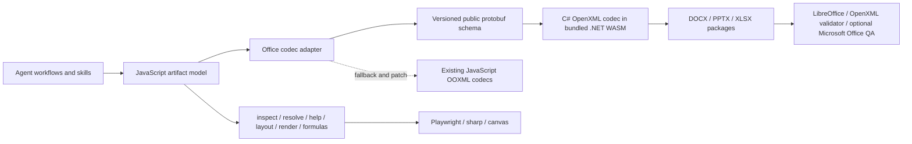

# Reference runtime architecture and clean-room direction

- Status: accepted direction, XLSX, DOCX, and PPTX WebAssembly vertical slices implemented; migration active
- Evidence snapshot: 2026-07-13
- Reference package: `office-artifact-tool@2.8.22`
- Reference runtime asset package: `@officer/walnut@0.1.210`

## Decision

The long-term Office I/O path for `open-office-artifact-tool` should be a bundled, clean-room .NET WebAssembly codec built with the public Microsoft Open XML SDK. JavaScript remains the agent-facing product layer. The existing Microsoft Office COM sidecar remains an optional renderer and compatibility oracle; it is not the core DOCX/PPTX/XLSX codec.

The target split is:

- JavaScript: artifact models, editing facades, formulas, inspect/resolve/help, layout, preview rendering, workflow orchestration, codec selection, and bounded input preflight.
- C# in bundled .NET WebAssembly: typed OPC/Open XML package reading and writing for DOCX, PPTX, and XLSX, package relationship/content-type handling, format-version validation, and preservation of package data that is outside the semantic model.
- A versioned public wire schema: independently designed messages shared by JavaScript and C#. The schema is an implementation boundary, not a clone of the reference runtime's private protobuf contract.
- Playwright/Skia/sharp/canvas: model preview and raster rendering.
- LibreOffice, Poppler, Open XML SDK validation, and optional Microsoft Office automation: render-backed and application-compatibility QA.
- PDF.js and the clean-room PDF implementation: PDF parsing/writing. The observed reference package does not expose a PDF model or PDF codec from its main module.

The existing JavaScript OOXML codecs remain useful as a fallback, a patch/inspection layer, a test oracle, and a migration safety net. They should not be deleted before the WebAssembly path proves equal or better behavior fixture by fixture.

## Clean-room boundary

This study used only observable and redistributable package facts:

- package manifests and file names;
- runtime boot metadata;
- public ESM exports and public object methods;
- public `.NET WebAssembly` assembly export names;
- shipped README, skills, and smoke tests;
- black-box calls using generated empty artifacts and byte counts.

It did not decompile, disassemble, copy, or translate the reference JavaScript bundle, the `Walnut` assembly, its WebAssembly binaries, native bindings, method bodies, or protobuf implementation. No reference runtime artifact may be copied into this project.

## Package evidence

The checked-out reference submodule is `e6dd700a79dae65ea53b0e775fa72ef6b8cc5376`. Its package manifest declares two bundled runtime dependencies:

- `@officer/walnut@0.1.210`
- `skia-canvas@^3.0.6`

Approximate installed footprint from `du -sk`:

| Area | KiB | Role |
| --- | ---: | --- |
| `dist/` | 10,880 | Compiled ESM product/model/formula/layout layer |
| `node_modules/@officer/walnut` | 12,624 | .NET WebAssembly Open XML codec runtime |
| `node_modules/skia-canvas` | 22,108 | Native text/raster canvas runtime |
| `skills/` | 6,460 | Agent instructions, scripts, templates, and QA workflows |

The main `dist/artifact_tool.mjs` file is 11,118,246 bytes. Public reflection found 1,163 ESM exports, including approximately 498 all-uppercase spreadsheet formula functions and 59 exports whose names explicitly mention proto conversion. These counts are inventory evidence, not a compatibility promise.

Node process-report evidence also shows that importing the main ESM module loads `skia-canvas/lib/skia.node` into the process. Skia is therefore a separate native text/raster dependency, not part of the C# Office codec. This project does not need to copy that eager-loading choice: renderer dependencies should remain optional or lazy so Office model and codec use does not fail on an unsupported native canvas build.

The public model surface shows substantial JavaScript ownership:

- `Workbook`: model collections, formulas/recalculation, trace, inspect/help/resolve/apply, collaboration, render, HTML, image, and export behavior, plus `toProto()`.
- `Presentation`: compose, model collections, inspect/help/resolve/apply, collaboration, render context, `toProto()`, `toPresentationBytes()`, and `toArtifactBundle()`.
- `DocumentModel`: document model/layout/export behavior, `toProto()`, and `toDocumentBytes()`.
- `SpreadsheetFile`, `PresentationFile`, and `DocumentFile`: the public Office file import/export facades.

The public `toProto()` methods return plain JavaScript objects. Top-level examples include workbook sheets/styles/theme/pivot caches, presentation slides/layouts/charts/images/theme, and document elements/sections/styles/comments/notes. `Presentation.toArtifactBundle()` returns an object with `rootArtifactId` and `artifacts`, indicating a second, package-oriented preservation path alongside the semantic presentation message.

## .NET WebAssembly evidence

`@officer/walnut` exposes runtime assets rather than a conventional JavaScript API. Its `blazor.boot.json` reports:

- `mainAssemblyName: "Walnut"`;
- 31 `.wasm` files in the runtime directory;
- `linkerEnabled: true`;
- `globalizationMode: "invariant"`.

The boot resource graph contains:

- `Walnut` at about 2.8 MiB;
- `DocumentFormat.OpenXml` at about 4.2 MiB;
- `DocumentFormat.OpenXml.Framework` at about 276 KiB;
- `Google.Protobuf` at about 312 KiB;
- `System.IO.Packaging`, `System.IO.Compression`, XML, collections, and other .NET assemblies;
- the .NET native/runtime JavaScript and WebAssembly host files.

The separate `DocumentFormat.OpenXml.Framework` and typed `DocumentFormat.OpenXml` resources strongly indicate Open XML SDK 3.x or later, because Microsoft split the framework package starting with 3.0. The exact reference version is not proven by the package metadata and is not required for the clean-room implementation.

Loading the runtime with its standard `dotnet.js` host and calling `getAssemblyExports("Walnut")` exposes only six codec classes and eight canonical methods:

| .NET export class | Method | Observed JS arity | Boundary |
| --- | --- | ---: | --- |
| `DocxReader` | `ExtractDocxProto` | 2 | DOCX bytes to document message bytes |
| `DocxExport` | `ExportProtoToDocx` | 1 | Document message bytes to DOCX bytes |
| `PptxReader` | `ExtractSlidesProto` | 2 | PPTX bytes to presentation message bytes |
| `PptxReader` | `ExtractPresentationArtifactBundle` | 2 | PPTX bytes to package-preserving bundle bytes |
| `PptxExport` | `ExportProtoToPptx` | 1 | Presentation message bytes to PPTX bytes |
| `PptxExport` | `ExportArtifactBundleToPptx` | 1 | Bundle bytes to PPTX bytes |
| `XlsxReader` | `ExtractXlsxProto` | 2 | XLSX bytes to workbook message bytes |
| `XlsxExport` | `ExportProtoToXlsx` | 1 | Workbook message bytes to XLSX bytes |

The second reader argument is optional in the observed empty-file calls. Its precise private meaning was not investigated because it is not necessary to establish the architecture and is outside the clean-room target.

## Black-box boundary proof

Direct public export calls were exercised with empty clean-room model objects. Only byte types, lengths, ZIP signatures, and roundtrip success were recorded.

| Format | Input/package bytes | Message bytes | Re-export bytes | Result |
| --- | ---: | ---: | ---: | --- |
| XLSX | 3,315 | 980 | 3,312 | Returned a valid ZIP/OOXML package |
| PPTX | n/a | 2,477 authored message | 7,668 | Returned a valid ZIP/OOXML package; extracted message was 3,581 bytes |
| DOCX | n/a | 2,086 authored message | 3,973 | Returned a valid ZIP/OOXML package; extracted message was 2,169 bytes |

For the same empty PPTX, the core presentation extraction returned 3,581 bytes and the artifact-bundle extraction returned 3,629 bytes. Both corresponding exporters produced valid OOXML ZIP packages. This proves a dual PPTX I/O contract without requiring knowledge of the private message fields.

Instrumenting only public JavaScript methods during normal file export observed calls to `Workbook.toProto()`, `Presentation.toProto()` plus `toPresentationBytes()`, and `DocumentModel.toProto()` plus `toDocumentBytes()`. This confirms that JavaScript owns model-to-message conversion while the .NET layer consumes serialized bytes.

The runtime also loaded successfully under Node with `PATH=/usr/bin:/bin`, where the Homebrew `dotnet` CLI was not visible, and still exposed all six codec classes. The SDK is required to build the assets, but end users receive and execute the published `dotnet.js`, runtime WebAssembly, and managed assemblies from npm.

One local timing sample measured about 1,058 ms for the large main-module import, 1 ms for an empty presentation model creation, 320 ms for the first PPTX export, and 20 ms for a second export in the same process. These machine-specific numbers are not a performance contract, but the warm-call difference is consistent with a cached runtime/codec instance and supports the requirement to initialize once per process.

## What the Open XML SDK contributes

The Microsoft Open XML SDK provides strongly typed package, part, relationship, and schema element APIs for WordprocessingML, PresentationML, and SpreadsheetML. It removes a large class of hand-maintained namespace, schema-order, relationship, content-type, and package-ownership errors. It also provides validation against Office format versions.

It does not provide the high-level agent artifact model, spreadsheet calculation engine, layout engine, presentation compose system, renderer, or application-equivalent pagination. The official project explicitly describes the SDK as a low-level Open XML/OPC API rather than a high-level productivity abstraction. The reference package's large JavaScript surface is consistent with that division.

Primary public references:

- [Microsoft Open XML SDK getting started](https://learn.microsoft.com/en-us/office/open-xml/getting-started)
- [Microsoft Open XML SDK repository and MIT license](https://github.com/dotnet/Open-XML-SDK)
- [.NET WebAssembly browser/Node application templates and JS interop](https://learn.microsoft.com/en-us/aspnet/core/client-side/dotnet-interop/wasm-browser-app)
- [Protocol Buffers C# generated code guide](https://protobuf.dev/reference/csharp/csharp-generated/)

## Current implementation state

The first source-built boundary now exists:

- `proto/open_office/artifact/v1/office_artifact.proto` is the independently designed, versioned public wire contract. Buf generates the shipped JavaScript binding; `Grpc.Tools` generates the C# binding from the same source.
- `native/OpenChestnut/src/OpenChestnut.Codec` uses `DocumentFormat.OpenXml` 3.5.1 and `Google.Protobuf` 3.35.1 for bounded XLSX/DOCX/PPTX import/export and structured diagnostics.
- `native/OpenChestnut/src/OpenChestnut.Runtime` exposes one `[JSExport]` byte-in/byte-out method and publishes a trimmed `browser-wasm` AppBundle.
- `src/codecs/open-chestnut.mjs` lazily initializes and caches that runtime. Family adapters such as `open-chestnut-presentation.mjs` map JavaScript models to the public wire schema, fail closed when direct authoring leaves a modeled slice, and carry validated source-package preservation state across imported edits.
- `runtime/open-chestnut` contains the reproducible release bundle, integrity manifest, CycloneDX SBOM, .NET license, and upstream third-party notices. It is built from this repository; it contains no reference-package artifact.
- The npm clean-install gate packs the real tarball, installs it in a temporary directory, removes `dotnet` from runtime `PATH`, and performs XLSX, DOCX, and PPTX export/import through the public package subpath.

The source and runtime distributions now have an explicit boundary. GitHub is authoritative for `native/OpenChestnut`, locked .NET dependencies, build tooling, tests, and reproducibility verification. npm carries the consumer-facing JavaScript/protobuf surface plus the already-built, integrity-inventoried WebAssembly runtime, so registry installs do not expose a second observable C# source-tree shape or pay its unpacked-size cost. The optional unbundled OfficeBridge source remains in npm because that adapter is configured as an external command rather than loaded from the OpenChestnut runtime. `test/package-contents.mjs` enforces both the required consumer assets and the absence of repository-only OpenChestnut/build files; the clean-install test proves this deletion does not alter XLSX/DOCX/PPTX behavior with `dotnet` removed from `PATH`. Hosted Linux run [`29386169191`](https://github.com/w31r4/open-office-artifact-tool/actions/runs/29386169191) verifies the 149-file consumer package while independently rebuilding the complete GitHub source twice into byte-identical 38-file/13,415,614-byte runtimes and passing OpenChestnut 118/118.

Worksheet-table color filters and sorts follow the public SpreadsheetML ownership boundary documented by Open XML SDK: [`ColorFilter`](https://learn.microsoft.com/en-us/dotnet/api/documentformat.openxml.spreadsheet.colorfilter) and [`SortCondition`](https://learn.microsoft.com/en-us/dotnet/api/documentformat.openxml.spreadsheet.sortcondition) point to a package-local [`DifferentialFormats`](https://learn.microsoft.com/en-us/dotnet/api/documentformat.openxml.spreadsheet.differentialformats) entry through `dxfId`. The public JavaScript/protobuf model deliberately carries stable semantics—cell fill or font target plus RGB/theme/indexed/automatic color and optional tint—not that package-local address. `XlsxCellStyleCodec` is the single differential-style owner: it recognizes only an exact solid-fill-only or font-color-only record, deduplicates authored records, and appends replacements without mutating a shared source entry. Existing differential formats retain their order and XML. A missing, malformed, or multi-property record keeps its table hidden and source-preserved instead of being flattened into a lossy color selector.

Query tables use a separate deep module because their package graph and security boundary differ from ordinary table XML. Open XML SDK exposes a TableDefinitionPart's [`QueryTableParts`](https://learn.microsoft.com/en-us/dotnet/api/documentformat.openxml.packaging.tabledefinitionpart.querytableparts), while [`QueryTable`](https://learn.microsoft.com/en-us/dotnet/api/documentformat.openxml.spreadsheet.querytable) selects an existing external connection by `connectionId`; the workbook's [`ConnectionsPart`](https://learn.microsoft.com/en-us/dotnet/api/documentformat.openxml.packaging.connectionspart) owns that definition. Its public [`QueryTableRefresh`](https://learn.microsoft.com/en-us/dotnet/api/documentformat.openxml.spreadsheet.querytablerefresh), [`QueryTableField`](https://learn.microsoft.com/en-us/dotnet/api/documentformat.openxml.spreadsheet.querytablefield), [`QueryTableDeletedFields`](https://learn.microsoft.com/en-us/dotnet/api/documentformat.openxml.spreadsheet.querytabledeletedfields), [`SortState`](https://learn.microsoft.com/en-us/dotnet/api/documentformat.openxml.spreadsheet.sortstate), and [`SortCondition`](https://learn.microsoft.com/en-us/dotnet/api/documentformat.openxml.spreadsheet.sortcondition) types define the bounded nested profile. `XlsxQueryTableCodec` accepts exactly one internal TableDefinitionPart → QueryTablePart edge, requires the selected ID to exist in the source ConnectionsPart, and publishes presence-aware root attributes through additive `SpreadsheetTableArtifact.query_table` field 17. Query field 24 independently carries recognized refresh metadata and field semantics; refresh fields 9/10 add existing deleted-field names and refresh-local sort state without renumbering prior wire fields. Sort-state field 4 carries optional `none`/`pinYin`/`stroke`, while condition field 5 carries a bounded custom list only for value sorts. Field IDs/order/count/table-column bindings, deleted-field count/order, and sort presence/condition count are immutable source topology, while recognized names, flags, sort range/case/method/direction/custom-list/value-icon-color selectors can change in place. `XlsxQuerySortStateCodec` shares the stable public sort/color messages and `XlsxCellStyleCodec` differential-format allocation, but patches only owned source elements so sort `extLst` content remains intact. The query modules enforce formula-fill/data-bound, clipped/data-bound, contained-range, unique-column, custom-list/value-kind exclusivity, and selector constraints. They may edit those semantics or rebind the root to another already-declared connection, but never author a connection, execute a refresh, or expose credentials/connection strings. Opaque deleted-field/sort branches are independently omitted while safe root/field edits continue; an opaque complete refresh is omitted without hiding an otherwise recognized root, and unsupported companion relationships still keep the complete parent table hidden/read-only. The query part path is exempted from opaque digest comparison only when the validated module actually writes it. The JavaScript codec recognizes the same stable projection for inspect/QA but refuses export because it cannot preserve this graph; source-free JavaScript and OpenChestnut authoring both fail closed.

OpenChestnut is the canonical implementation identity. The old `codecs/openxml-wasm` module and old build/test script names are deprecated compatibility aliases that delegate to the canonical module/scripts. There is no legacy runtime directory or assembly; status and exported file metadata identify the codec as `open-chestnut` even when invoked through an old alias.

The first slice covers workbook date systems, worksheets, primitive and cached-formula cells, merged ranges, row/column dimensions, gridline state, and frozen panes. Import stores one budget-checked source-package snapshot plus opaque part digests and relationship inventory in the public envelope. Second export verifies the snapshot SHA-256 and source identity, updates modeled fields in the original package through Open XML SDK, validates the complete result against Office 2021, and then rejects it unless all opaque part digests and relationships still match. This preserves imported styles, themes, tables, pivots, drawings, comments, validations, defined names, and arbitrary legal targets without pretending those features are semantically modeled by C#. Direct advanced authoring still uses the JavaScript codec, and missing/tampered preservation state remains fail-closed unless the caller explicitly accepts lossy rebuilding.

The XLSX DrawingML migration deliberately chooses embedded pictures rather than making `XlsxCodec` understand every Drawing child. `WorksheetArtifact.images` additive field 13 carries bounded picture semantics. Existing `SpreadsheetImageArtifact.anchor` field 5 remains an EMU-native `SpreadsheetOneCellAnchorArtifact`; additive fields 7/8 carry two-cell and absolute anchors; field 9 carries signed source-rectangle crop; field 10 carries bounded picture effects; field 11 carries bounded picture transform attributes. `SpreadsheetImageEffectsArtifact` owns grayscale, an optional luminance message with signed brightness/contrast, and presence-aware opacity, all in DrawingML's native thousandths of one percent. `SpreadsheetImageTransformArtifact` owns presence-aware rotation at native 1/60000-degree precision plus horizontal and vertical flips. The public model exposes -100..100 brightness/contrast and 0..100 opacity through `effects: { grayscale, brightnessPercent, contrastPercent, opacityPercent }`, plus -360..360 rotation and explicit flips through `transform: { rotationDegrees, flipHorizontal, flipVertical }`. Attribute/message presence is semantic: omitted `edit_as` keeps the native default, while omitted crop/effects/transform differ from explicit native nodes or zero/false attributes. All three anchor profiles point to a content-addressed envelope asset, and the source binding records the DrawingPart path/hash, full child ordinal, anchor hash, semantic hash, relationship locator, and non-visual ID. `XlsxImageAssetCatalog` validates and budgets PNG/JPEG bytes. `XlsxDrawingCodec` alone owns the Worksheet→DrawingPart→ImagePart package graph: it authors schema-ordered `blip effects → srcRect → stretch` and `xfrm → geometry`, patches name/description/same-kind geometry/`editAs`/crop/effects/transform, or replaces a uniquely referenced same-content-type ImagePart on a recognized import. `a:alphaModFix`, `a:grayscl`, and `a:lum` are editable only when unique and all other blip children are the retained `a:extLst`; `a:xfrm` attributes are editable only for one recognized transform whose unowned `a:off`/`a:ext` children stay in place. Unknown, duplicate, or out-of-range effect/transform graphs remain exact-preserved and reject replacement. Asset replacement retains the source part URI; cross-format/shared-part replacement and anchor-kind conversion fail closed. Picture locks, blip extensions, transform offset/extent children, and other unowned XML survive bounded edits. Imported add/remove, external links, unsupported anchors, advanced picture effects, groups, shapes, and other unowned drawing children remain opaque or fail closed; chart GraphicFrames are delegated to the separate codec below. This is the Parnas boundary for the format decision: JavaScript owns artifact semantics and content identity; the C# drawing module owns package relationships and XML mutation; relationship IDs never cross into durable asset identity. The `open-chestnut-basic` fixture sends all three anchor kinds plus crop/effects/transform through source-free WASM export, WASM import, source-preserving second export, JavaScript fallback import, Playwright preview, and LibreOffice/Poppler native QA.

The next DrawingML slice adds `WorksheetArtifact.charts` field 14 without making the picture codec parse graphic frames. `XlsxChartCodec` owns one relationship-backed bar/line/pie GraphicFrame and ChartPart profile: title, legend, shared string categories, ordered numeric series, optional category/value formulas, deterministic caches, and the same three native-EMU anchor messages. Series field 5 additively reuses `SpreadsheetColor`; `XlsxChartSeriesStyleCodec` accepts only its RGB branch and owns an exact direct `c:ser/c:spPr/a:solidFill/a:srgbClr` node. Source-bound exports may add, remove, or change that node without replacing unrelated series shape properties. Theme, gradient, no-fill, transformed-color, duplicate, or otherwise unrecognized fill graphs import without a semantic fill, make the chart read-only, and survive exact roundtrip. Additive chart fields 12/13 carry independently versioned `SpreadsheetChartAxisArtifact` messages for the primary category and value axes. `XlsxChartAxisCodec` owns their fixed package-local identity, title, number format, category label interval, value bounds, and major unit; optional protobuf scalars distinguish omitted values from explicit zero. Its source binding hashes both DrawingPart and ChartPart plus the full anchor ordinal, relationship locator, non-visual ID, and semantic projection. `XlsxDrawingCodec`, `XlsxChartCodec`, `XlsxChartSeriesStyleCodec`, and `XlsxChartAxisCodec` validate against one pre-mutation DrawingPart hash before either writes, which permits a picture and chart to change safely in the same source-preserving export. Chart name/title/legend/formula/cache/RGB-fill/axis edits retain residual ChartSpace XML only when anchor/type/series/point, literal/reference, and axis presence/identity topology stay fixed. Formula-referenced series names and logarithmic axes import read-only and exact-roundtrip; external data, combo/multi-plot charts, date/secondary/multi-axis profiles, line/marker/text styling, labels, and topology changes remain opaque or fail closed. The runnable fixture crosses a formula-backed line chart with edited series fill and primary axes plus three pictures through source-free WASM export, WASM import, source-bound edits, a second WASM export, JavaScript fallback import, Playwright, LibreOffice, and Poppler.

Hosted Linux run [`29390388809`](https://github.com/w31r4/open-office-artifact-tool/actions/runs/29390388809) passes the embedded-picture increment with OpenChestnut 123/123, OfficeBridge 5/5, the 151-file no-local-dotnet package, real Chromium/LibreOffice 24.2.7.2/Poppler 24.02.0, generated API/protobuf checks, and two byte-identical 38-file/13,459,646-byte runtime builds.

The same-format source-bound replacement increment passes hosted Linux run [`29391242886`](https://github.com/w31r4/open-office-artifact-tool/actions/runs/29391242886): OpenChestnut 124/124, OfficeBridge 5/5, the 151-file no-local-dotnet package, real Chromium/LibreOffice/Poppler QA, generated API/protobuf checks, and two byte-identical 38-file/13,461,182-byte runtime builds.

The additive two-cell-anchor increment keeps the existing one-cell wire field and adds field 7 rather than renumbering it. Local macOS gates pass OpenChestnut 125/125, OfficeBridge 5/5, all npm/runnable-skill tests, real Playwright/LibreOffice/Poppler QA, the 151-file no-local-dotnet package, and two byte-identical 39-file audits around a 38-file/13,472,444-byte runtime. Hosted Linux run [`29392551961`](https://github.com/w31r4/open-office-artifact-tool/actions/runs/29392551961) passes that same gate with OpenChestnut 125/125, OfficeBridge 5/5, real Chromium/LibreOffice 24.2.7.2/Poppler 24.02.0, and two byte-identical 38-file/13,472,446-byte runtime builds.

The additive absolute-anchor increment keeps fields 5 and 7 intact and adds field 8. Signed page-relative coordinates and positive extents stay in native EMUs across author/import/source-bound edit, while the public JavaScript model uses pixels. Local gates pass OpenChestnut 126/126, OfficeBridge 5/5, all npm/runnable-skill tests, the 151-file no-local-dotnet package (4,776,174 bytes compressed; 16,062,297 unpacked), and two byte-identical 39-file audits around a 38-file/13,478,076-byte macOS runtime. Hosted Linux run [`29393661818`](https://github.com/w31r4/open-office-artifact-tool/actions/runs/29393661818) passes the same feature with OpenChestnut 126/126, OfficeBridge 5/5, real Chromium/LibreOffice 24.2.7.2/Poppler 24.02.0, the 151-file clean install, and two byte-identical 38-file/13,478,078-byte runtime builds.

The additive source-rectangle increment keeps anchor fields 5/7/8 intact and adds crop field 9. Local C# and JS codec tests cover source-free authoring, signed inset/outset import, source-bound edit/removal with picture-lock preservation, range validation, and fail-closed replacement of an out-of-profile native crop. Local gates pass OpenChestnut 127/127, OfficeBridge 5/5, all npm/runnable-skill tests, the 151-file no-local-dotnet package (4,779,480 bytes compressed; 16,076,576 unpacked), and two byte-identical 39-file audits around a 38-file/13,485,244-byte macOS runtime. Hosted Linux run [`29395054954`](https://github.com/w31r4/open-office-artifact-tool/actions/runs/29395054954) passes the same increment with OpenChestnut 127/127, OfficeBridge 5/5, real Chromium/LibreOffice 24.2.7.2/Poppler 24.02.0, the 151-file clean install, and two byte-identical 38-file/13,485,246-byte runtime builds.

The additive picture-effects increment keeps fields 5/7/8/9 intact and adds field 10. C#, bundled-WASM, JavaScript fallback, wire-tag, and runnable-skill tests cover author/import/source-bound edit/removal, DrawingML child order, bounds, zero-opacity presence, preview approximation, picture-lock preservation, opaque duplicate-effect retention, and fail-closed replacement. Advanced effects such as duotone, shadows, blur, recolor, and arbitrary effect containers intentionally remain outside this profile. Local gates pass OpenChestnut 128/128, OfficeBridge 5/5, all npm/runnable-skill tests, the 151-file no-local-dotnet package (4,789,568 bytes compressed; 16,097,087 unpacked), and two byte-identical 39-file audits around a 38-file/13,494,972-byte macOS runtime. Hosted Linux run [`29396506905`](https://github.com/w31r4/open-office-artifact-tool/actions/runs/29396506905) passes the same increment with OpenChestnut 128/128, OfficeBridge 5/5, real Chromium/LibreOffice 24.2.7.2/Poppler 24.02.0, the 151-file clean install, and two byte-identical 38-file/13,494,974-byte runtime builds.

The additive picture-transform increment keeps fields 5/7/8/9/10 intact and adds field 11. Its optional scalar fields preserve explicit zero rotation and false flips independently from omission. C#, bundled-WASM, JavaScript fallback, wire-tag, model-preview, and runnable-skill tests cover author/import/source-bound edit/removal, -360..360-degree bounds, 1/60000-degree precision, horizontal/vertical flips, retained transform offset/extent children, out-of-profile transform preservation, and fail-closed replacement. Advanced affine/skew/perspective transforms remain outside this profile; worksheet anchor geometry remains independently modeled by fields 5/7/8. Hosted Linux run [`29398115651`](https://github.com/w31r4/open-office-artifact-tool/actions/runs/29398115651) closes the increment with OpenChestnut 129/129, OfficeBridge 5/5, real Chromium/LibreOffice 24.2.7.2/Poppler 24.02.0, the 151-file clean install, and two byte-identical 38-file/13,502,142-byte runtime builds.

The additive worksheet-chart increment keeps the picture fields intact and adds `WorksheetArtifact.charts` field 14 plus its independently versioned chart messages and source binding. Exact-SHA hosted Linux run [`29400392707`](https://github.com/w31r4/open-office-artifact-tool/actions/runs/29400392707) closes the bounded bar/line/pie vertical slice with OpenChestnut 130/130, OfficeBridge 5/5, the 152-file no-local-dotnet package, real Chromium/LibreOffice 24.2.7.2/Poppler 24.02.0, generated API/protobuf checks, and two byte-identical 38-file/13,547,710-byte runtime builds.

The additive primary-axis increment keeps all chart fields intact and assigns fields 12/13 to the category/value axis messages. C#, bundled-WASM, JavaScript fallback, wire-presence, and runnable-skill tests cover source-free authoring, explicit-zero bounds, source-bound title/format/interval/range/unit edits, residual XML retention, invalid ranges, pie-axis rejection, and fail-closed date/text-style profiles. A native logarithmic axis remains exact-preserved but read-only rather than being flattened. Local macOS gates pass OpenChestnut 131/131 around a reproducible 38-file/13,562,556-byte runtime and a 152-file package of 4,826,164 bytes compressed/16,207,709 bytes unpacked. Exact-SHA hosted Linux run [`29402319089`](https://github.com/w31r4/open-office-artifact-tool/actions/runs/29402319089) passes the same increment with OpenChestnut 131/131, OfficeBridge 5/5, real Chromium/LibreOffice 24.2.7.2/Poppler 24.02.0, the 152-file clean install, generated API/protobuf checks, and two byte-identical 38-file/13,562,558-byte runtime builds.

The additive chart-series-fill increment leaves the chart and axis messages intact and assigns series field 5 to the existing public `SpreadsheetColor` message. The bounded adapter accepts only `#RRGGBB`; C# owns only a direct untransformed `a:srgbClr` solid fill under series shape properties. Source-free bar/line/pie authoring plus source-bound fill add/remove/change preserve every unrelated series property, while native theme/gradient/no-fill/duplicate/transformed graphs import read-only and exact-roundtrip. Wire-tag, malformed-color, JavaScript fallback, bundled-WASM, runnable-skill, inspect/verify, and Office 2021 tests cover the projection. Local macOS gates pass OpenChestnut 132/132 around a reproducible 38-file/13,566,140-byte runtime and a 152-file package of 4,828,813 bytes compressed/16,214,744 bytes unpacked.

The DOCX slice models ordered paragraphs, limited direct run formatting, table text/merge geometry/fixed direct formatting, bounded whole-paragraph hyperlinks, bounded whole-paragraph simple fields, and direct or paragraph/numbering-style-linked numbered single-run paragraphs. `DocxHyperlinkCodec` recognizes one direct `w:hyperlink` with one text run, models external http(s) or internal bookmark targets plus text/tooltip/history, and changes those fields in place. `DocxPartContext` owns relationship additions/removals only for the hyperlink being edited and caches read-only `styles.xml`/`numbering.xml` documents without materializing Open XML SDK roots. `DocxFieldCodec` recognizes `w:fldSimple`, exposes its instruction and visible result, and edits one-result-run fields only when their command belongs to an explicit non-fetching catalog. `DocxTableGeometry` maps physical cells onto the effective `w:tblGrid`, including row offsets, `w:gridSpan`, `w:vMerge` restart/continuation state, effective row spans, and per-cell editability. Additive table wire fields leave the existing row text matrix at field 1. Source-free authoring consumes that same public shape only when one record exists for every physical cell, every row covers `grid_columns`, continuations exactly match the preceding row's grid column/span, continuation text is empty, and each origin's declared row span equals the chain. `DocxTableFormatting` owns optional wire field 3 as one complete profile: fixed dxa table width/indent, one positive width per logical grid column, derived merged-cell widths, four logical margins, six uniform direct RGB borders, and a filled/bold first row. Presence is not a claim about effective table-style formatting. Width sums, colors, dimensions, and Word border-size bounds are validated in JS and C# before output. `DocxTableCodec` emits schema-ordered `tblPr`/`tblGrid`/`tcPr`; `DocxDirectStyles` supplies the minimal default `TableGrid` definition. Reimport recognizes only this exact direct profile and exposes it through the JS model, but source-bound export rejects any formatting mutation in both adapters while the residual hash protects all other properties. Arbitrary style graphs, theme/conditional/per-cell formatting, gaps, overlaps, and malformed chains fail closed. Imported geometry remains source-bound: only simple unmerged, horizontally merged, and vertical-origin text nodes are updated in place while all table/row/cell/paragraph/run properties remain residual-hashed. `DocxNumberedParagraphCodec` owns paragraph assignment and fixed-topology text updates; the dedicated `DocxNumberingResolver` selects style-inherited levels through `w:lvl/w:pStyle`, follows `w:styleLink` and recursive `w:numStyleLink` → numbering-style `numId` chains, then applies instance level/start overrides. Paragraph-style `ilvl` is ignored by standard; direct paragraph `ilvl` remains authoritative. Additive wire field 7 carries the resolved numbering-style identity. Only the single text node is editable. Missing, duplicate, cyclic, over-deep, ambiguous, or unresolved style/definition graphs stay source-preserved and read-only instead of falling back to an editable plain paragraph. Imported body blocks carry their original body position, XML digest, semantic digest, residual digest where applicable, and editability evidence. The complex business-brief fixture retains its imported merge/edit/preservation gate; the `open-chestnut-merged-table` fixture starts from the public JS model, authors a three-column merged table with non-default fixed formatting directly through WASM, reimports and edits its origin, then passes package/model plus real Playwright/LibreOffice/Poppler gates.

Source-free numbering is a whole-document transaction. The JavaScript adapter assigns package-local direct `numberingId`/`abstractNumberingId` values when callers omit them and rejects conflicting definitions before crossing the wire. `DocxDirectNumbering` independently preflights every numbered block, groups instances and shared abstract definitions, and emits schema-ordered `w:abstractNum`/`w:lvl`/`w:num` plus direct paragraph assignments. This bounded slice covers text-marker levels 0 through 8; picture-bullet assets and style-linked graphs remain on the JavaScript codec.

Numbering-definition mutation is a separate batch transaction rather than a paragraph-local side effect. `DocxCodec` first verifies every source element/semantic binding, then `DocxNumberingEditPlanner` groups requested changes by direct `numId`/level. A group is editable only when every affected top-level paragraph has fixed editable topology, every requested `numberFormat`/`start`/`levelText` target is identical, and no nested paragraph or other package part references that instance. The planner materializes or updates a complete instance-local `w:lvlOverride`, never the shared `w:abstractNum`; paragraph identity/level/style remain residual-protected. Partial groups, style-inherited or style-linked graphs, duplicate/malformed overrides, and cross-part use fail closed. The `open-chestnut-numbering-edit` fixture now begins with bundled-WASM graph authoring, crosses bundled-WASM import/edit/export, then proves the override through reimport, Playwright, LibreOffice, and Poppler. Hosted Linux run [`29340497565`](https://github.com/w31r4/open-office-artifact-tool/actions/runs/29340497565) passes that real-render fixture, all 55 codec tests, the 208-file clean install, and two byte-identical 38-file/12,960,958-byte runtime builds.

The PPTX slice models slide order/size, a hash-bound Slide → Layout → Master package identity chain, direct Master/Layout backgrounds, owner-local Master/Layout placeholder text, top-level rectangle/ellipse shapes, bounded master `p:txStyles` defaults, and a bounded DrawingML paragraph/inline/text-body subset. Imported master, layout, placeholder, and slide IDs are stable locators inside the bound source package; they are not a promise of identity after an unrelated file is re-imported. Every slide records its native layout relationship, every layout records its owning master, and every direct placeholder records its raw owner-local shape-tree position plus XML/semantic hashes. Source export rejects graph, name, placeholder identity/topology/shape-level, layout-content, or slide-binding changes. From-scratch authoring currently creates one canonical master and its internal blank layout; template placeholders still require a validated source package.

Shape paragraphs and shape-local `a:lstStyle` levels 0 through 8 cover alignment, direct margins and signed indents, point/multiplier spacing, tab stops, bounded default-run and inline styles, text/field/line-break inlines, character/auto-number/no-bullet/picture markers, bounded click links, and bounded `a:bodyPr` layout. `PptxParagraphPropertiesCodec` coordinates the shared paragraph-property subset, `PptxListStyleCodec` owns shape-local list-level topology, `PptxBodyPropertiesCodec` owns text-frame properties and AutoFit, `PptxMasterTextStylesCodec` owns title/body/other master levels, `PptxBackgroundCodec` owns direct Master/Layout solid or background-style-reference fills without flattening inheritance, and `PptxPlaceholderCodec` owns only direct `p:ph` identity plus local text. `PptxPartContext` generalizes relationship ownership across Slide, Master, and Layout parts while the shared asset catalog owns content-addressed picture bytes.

Missing master-style and background fields preserve source state. Explicit master-level deletion removes only modeled properties and drops the native level node only when no residual attributes or children remain. Direct background replacement/addition accepts only `p:bgPr/a:solidFill` or `p:bgRef` with one untransformed RGB/theme color and a bounded reference index; direct removal, gradients, patterns, images, groups, effects, and transforms remain source-bound. Placeholder name/type/index and shape-tree position are identity; source-bound editing permits only fixed paragraph/inline-topology local text/body/list/link changes, while geometry/fill/shape style and effective inherited values remain source XML. Fixed-topology edits retain old media and relationships, validate against Office 2021, compare the guarded OPC graph, and require byte equality or residual equality outside explicitly changed slide/master/layout content. Custom-show/mouse-over links, field-local paragraph properties, WordArt/3D/compatibility features, placeholder geometry/shape styles, themes, charts, groups, notes, and arbitrary recursive OPC content remain source-preserved and fail closed when replaced. The runnable `open-chestnut-preservation` fixture crosses JavaScript authoring, bundled-WASM import, master/layout background and owner-local placeholder edits, a Layout-owned hyperlink addition, master-title edit, loss-aware master-body-level deletion, Master-owned external picture-marker addition, shape text/body/list edits, JavaScript semantic/package verification, and Playwright plus LibreOffice/Poppler rendering.

The placeholder slice passes 34 codec tests, a reproducible 38-file/12,864,199-byte runtime build, the 192-file clean-install package, and real Chromium/LibreOffice/Poppler gates. Hosted Linux run [`29298306670`](https://github.com/w31r4/open-office-artifact-tool/actions/runs/29298306670) passes that complete gate on `main`.

The subsequent DOCX hyperlink slice passes hosted Linux run [`29299603126`](https://github.com/w31r4/open-office-artifact-tool/actions/runs/29299603126). The bounded simple-field slice raises the gate to 39 codec tests, a reproducible 38-file/12,886,215-byte runtime build, the 195-file clean-install package, and real Chromium/LibreOffice/Poppler-backed document checks. Hosted Linux run [`29301993212`](https://github.com/w31r4/open-office-artifact-tool/actions/runs/29301993212) passes that complete milestone on `main`.

The OpenChestnut numbering-style-linked numbered-paragraph milestone passes hosted Linux run [`29327443007`](https://github.com/w31r4/open-office-artifact-tool/actions/runs/29327443007): canonical and compatibility APIs, 47 C# tests, the 202-file no-local-dotnet clean install, Chromium/LibreOffice/Poppler, OfficeBridge, and two byte-identical 38-file/12,913,854-byte runtime builds all pass on `main`. This evidence covers `w:lvl/w:pStyle`, `styleLink`, recursive `numStyleLink`, instance start overrides, and additive numbering-style wire identity.

The subsequent merge-aware DOCX table slice passes 49 local C# tests plus bundled-WASM and real Documents-skill gates with a 38-file/12,925,116-byte macOS runtime. Hosted Linux run [`29330878218`](https://github.com/w31r4/open-office-artifact-tool/actions/runs/29330878218) passes the same 49-test gate, the 203-file no-local-dotnet clean install, real Chromium/LibreOffice/Poppler checks, OfficeBridge tests, and two byte-identical 38-file/12,925,118-byte runtime builds.

The source-free merged-table authoring slice raises the current local gate to 51 C# tests, the 205-file no-local-dotnet clean install, and a 38-file/12,931,772-byte macOS runtime. Its dedicated runnable fixture uses OpenChestnut for initial DOCX creation rather than injecting XML into a JavaScript-authored package, and passes Office 2021 validation plus real Chromium/LibreOffice/Poppler QA. Hosted Linux run [`29336666891`](https://github.com/w31r4/open-office-artifact-tool/actions/runs/29336666891) passes the same 51-test/205-file gate, real browser/native render workflow, OfficeBridge, and two byte-identical 38-file/12,931,774-byte runtime builds.

The imported table-formatting edit increment keeps the local codec gate at 56 tests, the 209-file no-local-dotnet clean install, two matching 39-file reproducibility snapshots, and a 38-file/12,981,948-byte macOS runtime. Its public wire shape is unchanged. “Source-bound” now means an imported table must retain the complete recognized profile and fixed geometry, not that its modeled formatting values are immutable: width, indent, grid/cell widths, margins, uniform borders, and header fill update in place. Residual hashing canonicalizes only those exact fields, with explicit tests preserving unknown row and paragraph properties and rejecting profile removal or unrecognized formatting. The merged-table fixture proves text plus formatting edits through bundled WASM, real Chromium, and LibreOffice/Poppler. Hosted Linux runs [`29343501551`](https://github.com/w31r4/open-office-artifact-tool/actions/runs/29343501551) and [`29343983983`](https://github.com/w31r4/open-office-artifact-tool/actions/runs/29343983983) pass the 56-test/209-file gate, OfficeBridge 5/5, real browser/native-render workflow, and two byte-identical 38-file/12,981,950-byte runtime builds.

The XLSX number-format increment adds `CellArtifact.number_format_code` as additive field 4 and delegates SpreadsheetML style-table work to `XlsxNumberFormatCodec`. Source-free export emits a minimal valid stylesheet and deduplicates built-in/custom format records. Source-preserving export clones the selected cell XF, retaining every unmodeled style property, and avoids loading changes back into `styles.xml` when the effective format is unchanged. Invalid style indices, missing custom formats, unmapped locale-dependent built-ins, oversized codes, and control characters return structured `invalid_cell_number_format` failures. The OpenChestnut→OpenChestnut spreadsheet fixture now carries custom and percentage formats through authoring/import/export plus Playwright and LibreOffice/Poppler. The local codec gate is 60 tests, the 210-file no-local-dotnet clean install passes, two isolated 39-file builds are byte-identical, and the macOS runtime is 38 files/12,997,820 bytes. Hosted run [`29346231840`](https://github.com/w31r4/open-office-artifact-tool/actions/runs/29346231840) passes the same gate with a 12,997,822-byte Linux runtime, OpenChestnut 60/60, OfficeBridge 5/5, and real Chromium/LibreOffice/Poppler.

The XLSX native-formula increment adds `CellArtifact.formula_metadata` as additive field 5 with independent shared/legacy-array kind, shared index, and bounded A1 reference. The semantic model stores an expanded formula on every shared member while `XlsxFormulaCodec` derives the top-left master, validates the complete rectangular group, and emits master/follower `t/si/ref` records. Legacy arrays remain one top-left anchor plus `ref`; data-table, malformed, incomplete, overlapping, nested-formula, oversized, or unknown topology fails closed. Import expands followers using source-built relative A1 translation, including absolute references, protected strings/structured selectors, and digit-bearing function names. Source-preserving export compares formula semantics separately from cached value and number format, so those unrelated edits retain the exact source `<f>` XML. A formula edit with unmodeled attributes is rejected; writing through the JavaScript range facade detaches the full shared group before producing normal formulas. Group-range occupancy is registered once per group on both sides, keeping validation linear in represented topology instead of quadratic, and total represented formula topology is capped at 1,048,576 cells before iteration. The OpenChestnut fixture now carries shared and array records through authoring, import, source-preserving export, JavaScript reimport, Playwright, and native LibreOffice/Poppler QA. The local gate is 65 C# tests, 38 runtime files/13,037,756 bytes, two byte-identical isolated 39-file builds, and a 211-file no-local-dotnet package. Hosted runs [`29348628745`](https://github.com/w31r4/open-office-artifact-tool/actions/runs/29348628745) and [`29349197886`](https://github.com/w31r4/open-office-artifact-tool/actions/runs/29349197886) pass the base slice and topology hardening; the latter proves the same 65-test/211-file/real-render gates plus two byte-identical builds around a 13,037,758-byte Linux runtime.

The XLSX static-style increment adds `CellArtifact.style` as additive field 6. Its independent messages carry font, pattern fill, nine border edges and flags, alignment, protection, and RGB/theme/indexed/automatic colors with optional tint; number-format field 4 remains wire-compatible. `XlsxCellStyleCodec` becomes the sole stylesheet owner so one cell mutation derives exactly one XF while `XlsxNumberFormatCodec` remains a pure built-in-format vocabulary helper. Source-free export emits the required default font/fills/border and deduplicates complete resources/XFs. Source-bound export clones the selected XF and referenced resources, appends modeled replacements, and preserves residual XML such as font schemes and quote-prefix state instead of mutating shared records. Custom workbook themes, gradient fills, named/cell style inheritance, and other unmodeled style semantics remain source-preserved and fail closed when replacement would be lossy. Invalid font/color/fill/border/alignment/protection inputs return structured `invalid_cell_style` errors. Four new C# tests cover complete source-free authoring with Office 2021 validation, source-bound residual preservation, invalid inputs, and deduplication; the local gate is 69 tests, a 38-file/13,096,124-byte bundled runtime, and a 212-file no-local-dotnet package. The runnable spreadsheet fixture carries patterned/theme static styles through OpenChestnut authoring, import, source-preserving export, JavaScript reimport, Playwright, and native LibreOffice/Poppler QA. Hosted Linux run [`29351669274`](https://github.com/w31r4/open-office-artifact-tool/actions/runs/29351669274) passes the same 69-test/212-file/real-render gate plus two byte-identical builds around a 38-file/13,096,126-byte runtime.

The XLSX workbook-theme increment adds `WorkbookArtifact.theme` as additive field 4. Its independent message carries the theme name, the fixed DrawingML color-scheme order (`dk1`, `lt1`, `dk2`, `lt2`, six accents, hyperlink, followed hyperlink), and a source binding; it does not reuse style or package identity. `XlsxThemeCodec` writes a complete source-free `ThemePart`, recognizes RGB and system-color-with-`lastClr` inputs, and permits only the modeled name/RGB slots to change on a recognized imported theme. The imported font scheme, format scheme, extensions, and other residual XML remain in place. Per-color transforms remain residual unless that exact modeled slot is replaced. HSL/preset/scheme colors and incomplete or otherwise complex profiles remain exact-preserved but uneditable, so an attempted replacement fails closed instead of flattening their semantics. Four new C# tests cover complete authoring and Office 2021 validation, source-bound editing with residual preservation, unchanged complex-theme preservation and replacement rejection, plus invalid/tampered inputs. The local gate is 73 tests, a 38-file/13,116,092-byte runtime, and a 213-file no-local-dotnet package. Hosted Linux run [`29353440899`](https://github.com/w31r4/open-office-artifact-tool/actions/runs/29353440899) passes the complete gate with OpenChestnut 73/73, OfficeBridge 5/5, real Chromium/LibreOffice/Poppler, the 213-file clean install, and two byte-identical 38-file/13,116,094-byte runtime builds.

The XLSX worksheet-table increment adds `WorksheetArtifact.tables` at field 9 plus independent `SpreadsheetTableArtifact` and `SpreadsheetTableSourceBinding` messages. The semantic message owns name/range, headers/totals/filter-button choices, column names, style name, and first/last/row/column stripe toggles; cell data remains in the worksheet. The binding records worksheet/table part paths, relationship ID, XML/semantic hashes, and editability without treating package-local relationship IDs as durable object identity. `XlsxTableCodec` exclusively owns the bounded `tableParts` → TableDefinitionPart graph. Source-free export authors one relationship and complete table XML; source-bound edits retain part path/relationship identity and change only modeled XML. Query relationships, filter columns, differential styles, extensions, unknown attributes/children, and other complex profiles remain byte-exact hidden source slots and reject replacement. Imported add/remove, binding tamper, malformed ranges/names/columns, duplicate workbook-global names, and invalid header/filter profiles fail closed. Four C# tests plus bundled-JS, clean-install, and runnable-skill tests cover Office 2021 validation, semantic reimport, source identity, exact complex preservation, and structured errors. The local gate is 77 tests, a 38-file/13,144,252-byte runtime, and a 214-file package (about 4.8 MB compressed/16,494,888 bytes unpacked). Hosted Linux run [`29355927675`](https://github.com/w31r4/open-office-artifact-tool/actions/runs/29355927675) passes the complete gate with OpenChestnut 77/77, OfficeBridge 5/5, real Chromium/LibreOffice/Poppler, the 214-file clean install, and two byte-identical 38-file/13,144,254-byte runtime builds.

The table-column-formula increment keeps the preceding wire fields stable and adds `SpreadsheetTableArtifact.columns` at field 14. Each independent `SpreadsheetTableColumnArtifact` carries its name, calculated-column formula/array flag, totals function/label, and custom totals formula/array flag; formula strings share the public leading-`=` convention with worksheet cells. When both projections are present, legacy field-12 `column_names` remains authoritative for names so existing clients can rename imported columns without constructing the rich message. `XlsxTableCodec` reads/writes the native `calculatedColumnFormula`, `totalsRowFunction`, `totalsRowLabel`, and `totalsRowFormula` vocabulary, validates built-in versus custom/label profiles, includes the rich fields in the source semantic hash, and preserves the TableDefinitionPart path and relationship during edits. Cell values/formulas remain independently owned by `XlsxCodec`, which avoids hidden table XML mutations of the public worksheet grid. Filter columns, query-table graphs, differential styles, extensions, and unknown column attributes/children remain exact-preserved read-only profiles. Three additional C# tests cover Office 2021-valid author/import, identity-preserving source edits, and invalid formula/totals combinations; bundled-JS, JavaScript-codec, clean-install, and runnable-skill tests cover both public projections and real render QA. The complete local gate is 80 C# tests, a 38-file/13,155,516-byte macOS runtime, and the 214-file no-local-dotnet package. Hosted Linux run [`29357896900`](https://github.com/w31r4/open-office-artifact-tool/actions/runs/29357896900) passes OpenChestnut 80/80, OfficeBridge 5/5, real Chromium/LibreOffice/Poppler, the same 214-file clean install, and two byte-identical 38-file/13,155,518-byte runtime builds.

The table-filter increment adds `SpreadsheetTableArtifact.filters` at field 15 without changing fields 1–14. Each `SpreadsheetTableFilterArtifact` uses a zero-based table column index and exactly one independently versionable criteria branch: `SpreadsheetTableValueFilterArtifact` carries exact selected strings plus optional blank inclusion, while `SpreadsheetTableCustomFilterArtifact` carries one or two comparisons and explicit OR/AND composition. Supported custom operators are the six SpreadsheetML comparison tokens. `XlsxTableCodec` owns the corresponding `autoFilter/filterColumn/filters/customFilters` XML, includes it in the table semantic hash, and patches a recognized source table without changing its part path or worksheet relationship. Dynamic/date-group/color/icon/Top10 filters, per-column button overrides, sort state, query relationships, extensions, and unknown attributes remain exact-preserved read-only residuals; a dedicated dynamic-filter corpus test proves byte-exact second export. JavaScript and OpenChestnut adapters expose the same public table model, and the runnable fixture crosses both filter kinds through bundled WASM, package inspection, Playwright, and LibreOffice/Poppler. The local gate is 84 C# tests, a 38-file/13,172,924-byte macOS runtime, and a 214-file package at about 4.83 MB compressed/16,578,075 bytes unpacked. Hosted Linux run [`29359575561`](https://github.com/w31r4/open-office-artifact-tool/actions/runs/29359575561) passes OpenChestnut 84/84, OfficeBridge 5/5, real Chromium/LibreOffice/Poppler, the same 214-file clean install, and two byte-identical 38-file/13,172,926-byte runtime builds.

The table-sort increment adds `SpreadsheetTableArtifact.sort_state` at field 16 without changing fields 1–15. `SpreadsheetTableSortStateArtifact` carries the sort range, case sensitivity, and an ordered list of `SpreadsheetTableSortConditionArtifact` messages; each supported condition is a unique single-column value sort with the same row span as the containing sort range and an explicit ascending/descending direction. `XlsxTableCodec` reads and writes the corresponding `autoFilter/sortState/sortCondition` graph, includes it in the semantic hash, and validates that the sort and conditions stay inside the table range. `columnSort`, locale-specific `sortMethod`, custom lists, color/icon/differential-style sorts, Office 2010 conditions, extensions, and unknown attributes remain exact-preserved read-only profiles; a color-sort corpus test proves byte-exact unrelated edits and lossy replacement rejection. JavaScript, bundled WASM, the fallback codec, clean-install package, and the runnable spreadsheet fixture expose the same public shape. Four new C# tests bring the local corpus to 88/88, and the rebuilt macOS runtime remains 38 files at 13,182,652 bytes. The reviewed unpacked package gate rises by 100 KB to 16,700,000 bytes because the source-built runtime, public schema, source, and tests are all shipped; compressed size remains far below the unchanged 8,000,000-byte gate. Hosted Linux run [`29361489913`](https://github.com/w31r4/open-office-artifact-tool/actions/runs/29361489913) passes OpenChestnut 88/88, OfficeBridge 5/5, the 214-file clean install, real Chromium/LibreOffice/Poppler, and two byte-identical 38-file/13,182,654-byte runtime builds.

The advanced table-filter increment preserves `SpreadsheetTableArtifact.filters` at field 15 and adds branches rather than renumbering the existing value/custom wire contract. `SpreadsheetTableValueFilterArtifact` adds grouped dates at field 3 and calendar type at field 4 because both map to the native `<filters>` element; Open XML SDK Office 2021 validation proves exact values and `dateGroupItem` children are alternatives within one instance, so the codec rejects mixed profiles. `SpreadsheetTableFilterArtifact` adds dynamic filters at field 4 and Top10 filters at field 5. Dynamic filters carry the standard SpreadsheetML type plus optional `val`/`maxVal` thresholds; Top10 carries top/bottom, item/percent, requested value, and optional calculated cutoff. Date groups require the complete year-through-grouping field hierarchy and bounded calendar vocabulary. C#, the OpenChestnut adapter, JavaScript fallback, clean-install probe, and runnable spreadsheet fixture share the same public shapes; source-bound edits retain table part and relationship identity. At that milestone icon filters remained byte-exact opaque slots, with color/icon filters, query graphs, differential styles, and locale/custom-list sorts still pending. Three additional C# tests bring the local corpus to 91/91. The rebuilt macOS runtime remains 38 files at 13,204,668 bytes; the 214-file package is about 4.85 MB compressed and 16,666,530 bytes unpacked, below the unchanged reviewed 8,000,000/16,700,000-byte gates. Hosted Linux run [`29364080261`](https://github.com/w31r4/open-office-artifact-tool/actions/runs/29364080261) passes OpenChestnut 91/91, OfficeBridge 5/5, the clean install, real Chromium/LibreOffice/Poppler, and two byte-identical 38-file/13,204,670-byte runtime builds.

The icon-profile increment keeps filter field 15 and sort-state field 16 stable. `SpreadsheetTableFilterArtifact.icon` is additive oneof field 6, and `SpreadsheetTableSortConditionArtifact.icon` is additive field 3; both reuse `SpreadsheetTableIconArtifact`, whose optional field-2 `icon_id` distinguishes zero from the native absent/no-icon selector. The codec accepts the 17 main-namespace `ST_IconSetType` values exposed by the Open XML SDK and bounds each ID to its three-, four-, or five-icon cardinality. It reads/writes `iconFilter` and `sortCondition sortBy="icon"`, hashes the semantics, and permits identity-preserving second edits. The JS artifact model, fallback serializer/parser, bundled adapter, clean-install probe, and runnable fixture expose the same `{ kind: "icon", iconSet, iconId? }` contract. Color filters/sorts still remain byte-exact hidden slots because a stable differential-format model must precede exposing `dxfId`. Four additional C# tests bring the corpus to 94/94, including Office 2021 validation, no-icon presence semantics, invalid-set/ID rejection, source identity, and opaque color-filter preservation. The rebuilt macOS runtime has 38 files/13,210,300 bytes. Hosted Linux run [`29365621713`](https://github.com/w31r4/open-office-artifact-tool/actions/runs/29365621713) passes OpenChestnut 94/94, OfficeBridge 5/5, clean install, real Chromium/LibreOffice 24.2.7.2/Poppler 24.02.0, and two byte-identical 38-file/13,210,302-byte runtime builds.

The color-profile increment keeps all earlier wire numbers stable. `SpreadsheetTableFilterArtifact.color` is additive oneof field 7, `SpreadsheetTableSortConditionArtifact.color` is additive field 4, and `SpreadsheetTableColorArtifact` uses an explicit target oneof so a false/default scalar cannot masquerade as a valid selector. Both JS codecs and the bundled adapter expose `{ kind: "color", target: "cell"|"font", color }`; the stylesheet owner alone maps that semantic record to `dxfId`. Source-free filters/sorts deduplicate equal differential formats. A source-bound color edit appends a new record and keeps the original differential-format prefix byte-equivalent, so another rule sharing the old ID cannot change accidentally. Three additional C# tests bring the local corpus to 97/97; JavaScript fallback, bundled-WASM, clean-install, and runnable-skill tests cover RGB and theme+tint fill/font selectors, second edits, invalid targets, missing colors, complex-profile preservation, and Office 2021 validation. The rebuilt macOS runtime has 38 files/13,220,028 bytes. Development test sources now remain GitHub-only rather than npm runtime inputs, reducing the clean-install tarball to 207 files, about 4.82 MB compressed, and 16,399,522 bytes unpacked without removing public source, runtime, schemas, fixtures, or reproducibility tooling. Hosted Linux run [`29367655620`](https://github.com/w31r4/open-office-artifact-tool/actions/runs/29367655620) passes OpenChestnut 97/97, OfficeBridge 5/5, real Chromium/LibreOffice/Poppler, the same clean install, and two byte-identical 38-file/13,220,030-byte runtime builds.

The QueryTable increment adds only `SpreadsheetTableArtifact.query_table` field 17 and its independent messages; all earlier table fields remain unchanged. `XlsxQueryTableCodec` is the sole owner of the TableDefinitionPart → QueryTablePart decision and validates the source ConnectionsPart before exposing root semantics. Three additional C# tests bring the local corpus to 100/100 and cover identity-preserving edits, source-free/missing-connection/tampered-binding rejection, Office 2021 validation, and exact hidden fallback. Bundled-WASM and JavaScript tests prove presence-aware false values, connection/query-field/extension preservation, public model inspection, and JavaScript lossy-export rejection. The runnable fixture disables refresh and skips native office rendering so its external connection is never executed, while Playwright still covers render QA. The rebuilt macOS runtime has 38 files/13,278,396 bytes and two isolated builds are byte-identical across 39 audited files. The 209-file package is about 4.84 MB compressed and 16,502,594 bytes unpacked, leaving 197,406 bytes below the unchanged gate; clean install imports/edits the slice with `dotnet` absent from `PATH`. Hosted run [`29369709275`](https://github.com/w31r4/open-office-artifact-tool/actions/runs/29369709275) passes the complete QueryTable gate with OpenChestnut 100/100, OfficeBridge 5/5, real Chromium/LibreOffice/Poppler, the 209-file clean install, and two byte-identical 38-file/13,278,398-byte Linux runtime builds.

The QueryTable refresh/field increment preserves every prior wire number and adds only `SpreadsheetTableQueryArtifact.refresh` at field 24 plus independent refresh/field messages. The bounded model distinguishes absent from explicit false/zero, exposes existing field names and four flags, and treats field ID, order, count, and `tableColumnId` as immutable source identity. `XlsxQueryTableCodec` patches only owned attributes, preserves field-level and refresh-level residual XML, and leaves invalid/unrecognized refresh content opaque without disabling safe root edits. Open XML SDK validation surfaced and now guards two cross-field invariants: `fillFormulas=true` requires `dataBound=false`, while `clipped=true` requires `dataBound=true`. Two new C# tests and the extended vertical slice bring the local corpus to 102/102. Bundled-WASM, JavaScript fallback, wire-presence, invalid-mutation, and runnable-skill tests cover second export, identity rejection, opaque extension retention, and the unchanged no-refresh-execution boundary. The rebuilt macOS runtime has 38 inventoried files/13,298,876 bytes and is byte-identical across two isolated 39-file audits. The 209-file package is about 4.85 MB compressed/16,548,114 bytes unpacked, leaving 151,886 bytes below the unchanged gate. Hosted run [`29371595065`](https://github.com/w31r4/open-office-artifact-tool/actions/runs/29371595065) passes OpenChestnut 102/102, OfficeBridge 5/5, the complete npm/docs/package/runnable-skill gate, real Chromium/LibreOffice/Poppler, the no-local-dotnet clean install, and two byte-identical 38-file/13,299,390-byte Linux builds.

The QueryTable history/sort increment is additive again: `SpreadsheetTableQueryRefreshArtifact.deleted_field_names` uses field 9 and `sort_state` uses field 10, reusing the already public value/icon/color sort messages rather than creating a second selector vocabulary. A new `XlsxQuerySortStateCodec` keeps sort parsing/validation/patching out of the QueryTable root module. Deleted-field count/order and sort presence/condition count are source identity; safe names and recognized sort semantics are editable, while standard-but-unsupported or malformed nested profiles stay independently opaque. C# tests cover Office 2021-valid import/edit/reimport, extensions, topology/range/duplicate rejection, and safe root/field edits across opaque nested branches. Bundled-WASM, JavaScript fallback, wire-tag, invalid-mutation, and runnable-skill tests cross the same public-standard graph without executing its connection. The 103-test .NET corpus is green; the rebuilt macOS runtime remains 38 files/13,311,676 bytes and two isolated builds are byte-identical across 39 audited files. The 210-file dry-run package is about 4.86 MB compressed/16,591,200 bytes unpacked, leaving 108,800 bytes below the unchanged gate. Hosted run [`29373615650`](https://github.com/w31r4/open-office-artifact-tool/actions/runs/29373615650) passes the same gate with two byte-identical 38-file/13,311,678-byte Linux builds.

The workbook-connection increment keeps every table/query wire number stable and additively assigns `WorkbookArtifact.connections` field 5 to independent `SpreadsheetConnectionArtifact` messages. `XlsxConnectionCodec` becomes the sole workbook-level ConnectionsPart owner, so multiple sheets and QueryTables consume one parsed resource instead of independently reading or writing it. The first bounded editable profile is a source-bound database/type-5 connection root: name, optional description, keep-alive, interval (`0..32767`), background, refresh-on-load, and save-data cross the wire. The source binding carries part, element, and semantic hashes; count/order and ID/type/refreshed-version remain immutable. Provider strings, SQL commands, credentials, source/ODC paths, child graphs, unknown root attributes, extensions, and all other connection types stay outside the semantic model and are exact-preserved. Source-free creation, removal, reordering, identity mutation, and binding tamper fail closed, while QueryTable edits may still target any existing source connection ID. The JavaScript fallback projects the same type-5 metadata for inspect/resolve/verify but still rejects lossy graph export. C#/bundled-WASM/JavaScript/runnable-skill tests cover edit/reimport, explicit false values, interval bounds, hidden provider/command/credential/extension retention, opaque companion connections, and no refresh execution. Two new C# tests bring the local corpus to 105/105; the rebuilt macOS runtime has 38 files/13,329,596 bytes and two isolated builds are byte-identical across 39 audited files. The no-local-dotnet clean install and 211-file/16,639,258-byte package gate pass locally. Hosted run [`29375302426`](https://github.com/w31r4/open-office-artifact-tool/actions/runs/29375302426) passes the full milestone with OpenChestnut 105/105, OfficeBridge 5/5, real Chromium/LibreOffice/Poppler, the 211-file clean install, and two byte-identical 38-file/13,329,598-byte Linux runtime builds.

The locale/custom-list sort increment is additive without creating a second table/query vocabulary: `SpreadsheetTableSortStateArtifact.sort_method` uses optional field 4, and `SpreadsheetTableSortConditionArtifact.custom_list` uses optional field 5. Omission remains distinguishable from explicit SpreadsheetML `none`; `pinYin` and `stroke` complete the public Open XML SDK method vocabulary. A custom list is bounded, control-free, and valid only on an ordinary value condition, so it cannot be combined with icon/color selectors. Ordinary tables author and reimport the profile, while `XlsxQuerySortStateCodec` patches the same fields in place without disturbing `extLst`, connection, field, deleted-field, or relationship topology. Unknown `columnSort` remains opaque. The existing 105-test C# corpus now covers Office 2021-valid source-free and source-bound method/custom-list roundtrips plus invalid method and selector combinations; wire-tag, bundled-WASM, JavaScript fallback, and both runnable spreadsheet fixtures exercise the same public shape. The rebuilt macOS runtime remains 38 files and grows only to 13,333,180 bytes; the 211-file package remains below its unchanged 16,700,000-byte unpacked gate. Hosted run [`29376600928`](https://github.com/w31r4/open-office-artifact-tool/actions/runs/29376600928) passes the complete gate with two byte-identical 38-file/13,333,182-byte Linux runtime builds, real Chromium/LibreOffice/Poppler, and the no-local-dotnet clean install.

The following direction-aware sort increment closes that earlier `columnSort` gap without authoring invalid table XML. `WorksheetArtifact.sort_state` is additive field 10 and `SpreadsheetTableSortStateArtifact.column_sort` is optional field 5, so omission remains distinct from explicit false. Public SpreadsheetML documentation limits `columnSort` to ranges without AutoFilter; OpenChestnut therefore supports it for source-free/source-bound worksheet sort state and fixed-topology QueryTable refresh sort state, while a Table AutoFilter rejects either explicit value. Shared `XlsxSortStateCodec` replaces duplicate Table/Query parsing and owns bounded method/direction/value/icon/color/custom-list validation, XML authoring/patching, and semantic hashes. Row sorting requires unique single-column conditions with the sort range's row span; column sorting requires unique single-row conditions with its column span. Syntactically valid but unsupported geometry remains hidden in the hash-bound source package and cannot be overwritten. The JavaScript fallback, public adapter, generated wire, runnable basic fixture, and source-bound QueryTable fixture use the same shape. Two new C# tests bring the local corpus to 107/107; the rebuilt macOS runtime has 38 files/13,334,204 bytes and two isolated builds are byte-identical across 39 audited files. The 212-file no-local-dotnet package is about 4.88 MB compressed/16,661,914 bytes unpacked, below the unchanged reviewed gates. Hosted run [`29378462244`](https://github.com/w31r4/open-office-artifact-tool/actions/runs/29378462244) passes the complete gate with OpenChestnut 107/107, OfficeBridge 5/5, verified Chromium, LibreOffice 24.2.7.2, Poppler 24.02.0, the clean install, and two byte-identical 38-file/13,334,206-byte Linux runtime builds.

The defined-name increment additively assigns `WorkbookArtifact.defined_names` field 6. `XlsxDefinedNameCodec` recognizes only ordinary sheet-qualified A1 ranges, with optional `localSheetId`, comment, and presence-aware hidden state. Each imported record carries its ordinal plus workbook, element, and semantic hashes; edits may change name, range, scope, comment, or hidden state, but count/order/binding stay fixed. Reserved built-ins, formula/constant names, macro/function attributes, extensions, and malformed profiles remain opaque and exact-preserved. The JavaScript model/fallback, bundled adapter, public wire, and `open-chestnut-basic` fixture share the projection. C# tests cover source-free authoring, explicit false, source-bound edits, opaque preservation, collision/topology/binding rejection, and Office 2021 validation. Hosted Linux run [`29379765985`](https://github.com/w31r4/open-office-artifact-tool/actions/runs/29379765985) passes the complete 110-test, real-render, clean-install, package, and reproducibility gate with two byte-identical 38-file/13,356,734-byte runtime builds.

The worksheet metadata/view contract keeps `WorksheetArtifact.visibility`/`source` at additive fields 11/12 and evolves workbook windows without duplicating primary state: existing `WorkbookArtifact.view` field 8 remains window 0, while additive `additional_views` field 9 contains only windows 1..N. Each view carries its active worksheet at field 1, source binding at field 2, and ordered selected worksheet IDs at field 3. Source binding field 6 contains one independent worksheet-view binding per sheet: stable worksheet ID, part path, actual view ordinal, matching `workbookViewId`, whole-part/view XML hashes, presence-aware source `tabSelected`, and editability. `XlsxWorkbookViewCodec` coordinates every `WorkbookView.ActiveTab` with its `SheetView.TabSelected` group and authors a complete one-per-window/per-worksheet graph. Imported multi-window state is editable only when that graph is complete; source-bound window count/order is immutable, and edits touch only the owned active/selection attributes while unchanged explicit false values retain their native presence. Window geometry, `firstSheet`, panes, zoom, visibility, extensions, and other residual XML stay intact. Missing/incomplete single-window views remain readable but selection edits fail closed, while incomplete multi-window graphs stay opaque and protect every source-active/selected visible tab from hiding. JavaScript fallback/import, `workbook.windows`, inspect/layout/resolve/verify, generated help, clean install, and `open-chestnut-basic` share the model; the fixture keeps primary `Icon Rules` with `Summary` selected and adds a second `Advanced Filters` window with its own `Summary` group across two WASM passes. The new source-free/import/edit/topology test brings the local C# corpus to 119/119; the rebuilt macOS runtime has 38 files/13,419,196 bytes. Hosted Linux run [`29387474021`](https://github.com/w31r4/open-office-artifact-tool/actions/runs/29387474021) passes the 150-file clean install, OpenChestnut 119/119, OfficeBridge 5/5, real Chromium/LibreOffice/Poppler, and two byte-identical 38-file/13,419,198-byte runtime builds.

The dynamic-array increment reuses `CellArtifact.formula_metadata` field 5 and adds only enum kind 3; it does not introduce a second formula payload or renumber the shared/legacy kinds. Per the public Microsoft SpreadsheetML extensions, an anchor remains an array formula with a spill `ref`, while `c@cm` is a one-based cell-metadata index into an XLDAPR record whose future-metadata extension contains `dynamicArrayProperties`. `XlsxFormulaCodec` owns formula topology and `XlsxDynamicArrayCodec` exclusively owns that workbook package graph. Source-free export authors the canonical metadata type, extension URI, future block, cell record, relationship, and content type. Source-bound import recognizes only the bounded single-record profile, preserves its part and residual XML across formula/cached/style edits, and removes only the owned cell marker when the formula is detached; adding a dynamic formula without a recognized record or modifying an opaque/mixed metadata block fails closed. The JavaScript fallback authors/imports the same public graph, restores cached spill ownership before recalculation, and evaluates package compatibility prefixes such as `_xlfn.` without rewriting the stored formula. `open-chestnut-basic` now carries a `SEQUENCE` spill through source-free authoring, two WASM passes, JavaScript reimport, Playwright, and LibreOffice/Poppler. The local codec gate rises to 121/121 and the rebuilt macOS runtime contains 38 files/13,431,996 bytes. The package layout follows Microsoft's published [`dynamicArrayProperties`](https://learn.microsoft.com/en-us/openspecs/office_standards/ms-xlsx/0f724492-11ea-437f-ac2b-cc097b255da1), [`CT_DynamicArrayProperties`](https://learn.microsoft.com/en-us/openspecs/office_standards/ms-xlsx/d1ef676d-d970-4ddd-b642-62f5e0c291e0), [XLDAPR metadata extension](https://learn.microsoft.com/en-us/openspecs/office_standards/ms-xlsx/3dd44d53-847b-402f-a8c7-41a85024caf7), and [one-based `cm` contract](https://learn.microsoft.com/en-us/openspecs/office_standards/ms-oe376/b3e61d30-f15f-4712-9252-50883cbf0f8c).

The C# `OfficeBridge` remains a separate optional Windows JSON stdin/stdout process for render/convert/application checks; it is not part of the core codec path.

Hosted Linux run [`29389011985`](https://github.com/w31r4/open-office-artifact-tool/actions/runs/29389011985) passes the dynamic-array milestone with OpenChestnut 121/121, OfficeBridge 5/5, the 150-file no-local-dotnet package, real Chromium/LibreOffice 24.2.7.2/Poppler 24.02.0, generated API/protobuf checks, and two byte-identical 38-file/13,431,998-byte runtime builds.

## Target architecture

### JavaScript owns

- stable agent-facing IDs and public object facades;
- editing and composition semantics;
- spreadsheet calculation, dependency graphs, and formula help;
- inspect, resolve, help, verify, layout, and preview APIs;
- renderer selection and visual QA;
- conversion between the public JS model and the project's own wire schema;
- codec policy such as `wasm`, `js`, or controlled fallback;
- input preflight, output limits, timeouts, and structured errors.

### C# OpenChestnut owns

- opening and creating WordprocessingDocument, PresentationDocument, and SpreadsheetDocument packages from bounded byte streams;
- typed part, content-type, relationship, and schema element handling;
- semantic extraction into the project's public messages;
- semantic export from those messages;
- validation and package-level serialization of native shared/legacy/dynamic-array formula topology and its workbook metadata graph, while formula calculation remains in JavaScript;
- preservation of package parts and relationships not represented by the editable model;
- Open XML format-version validation and structured diagnostic records;
- codec-local part/count/byte/depth budgets.

It must not own agent IDs, workflow policy, formula evaluation, layout, raster rendering, or network access.

### Native Office automation owns

- optional Word/Excel/PowerPoint application render and conversion;
- recalculation, field update, and application-specific compatibility checks that Open XML alone cannot prove;
- Windows-only baselines.

It remains outside the default import/export path and outside the required npm runtime.

## Independent wire contract

The repository should publish its own `.proto` sources and generated C#/JavaScript bindings. The initial contract should include:

- a protocol version and artifact family;
- the semantic document/presentation/workbook payload;
- stable model IDs that are explicitly distinct from native OOXML IDs;
- binary assets with media type, digest, and bounded bytes;
- source-package identities needed for loss-aware editing;
- an opaque package graph for unsupported parts, internal/external relationships, and content types;
- import/export diagnostics and unsupported-feature records;
- deterministic unknown-field and version-skew behavior.

The opaque graph is essential. The reference runtime's separate PPTX artifact-bundle path is observable evidence that a semantic message alone is insufficient for high-fidelity third-party roundtrips.

The schema must be designed from this project's public model, ECMA-376/ISO 29500, OPC, and Open XML SDK types. It must not reuse reference field numbers, message names, binary fixtures, or generated code.

## Runtime packaging requirements

- Build assets from checked-in C# and `.proto` sources in CI.
- Bundle the published `dotnet.js`, native runtime WebAssembly, managed assemblies, boot manifest, and integrity metadata in the npm tarball.
- Load the runtime lazily on the first DOCX/PPTX/XLSX codec call and cache one initialized runtime per process.
- Require no end-user .NET SDK, Microsoft Office, LibreOffice, or network access for normal Office import/export.
- Keep build-time SDK/workload requirements separate from runtime requirements.
- Record all NuGet/runtime licenses in `THIRD_PARTY_NOTICES.md`, generate an SBOM, and fail package tests if required runtime assets are absent.
- Pin reproducible .NET, Open XML SDK, and protobuf versions.
- Do not ship symbols, source maps, debug files, or reference-package assets unless deliberately licensed and required.

The build is pinned by `global.json` to .NET SDK 8.0.128 and uses the 8.0.28 `wasm-tools`/`wasm-experimental` workload packs. NuGet restore runs in locked mode. Native Emscripten and managed wrapper bytes can differ across build hosts even though the output is portable WebAssembly, so CI performs two isolated builds on the same hosted runner and rejects any byte or file-inventory difference between them; the checked-in consumer bundle is separately covered by its integrity manifest, clean-install test, and functional codec gates. Consumers do not run this build toolchain.

## Migration plan

1. **Implemented:** add a source-built `native/OpenChestnut` scaffold and a minimal versioned schema.
2. **Implemented:** prove one end-to-end XLSX vertical slice: JS model to message bytes to C# Open XML SDK to XLSX, then back to the JS model.
3. **Implemented:** package the runtime and run the installed tarball with `dotnet` removed from runtime `PATH`.
4. **Implemented locally and in hosted Linux CI:** exercise the existing spreadsheet formula-summary and arbitrary-path fixtures through both `wasm` and `js` codecs. Compare semantic inspect output, modeled verification, Open XML validation, all-sheet Playwright output, and LibreOffice/Poppler native pages.
5. **Implemented for imported XLSX:** retain a hash-bound source package, edit modeled fields in place, and verify opaque part/relationship preservation after write. Broader third-party corpus roundtrips remain the next XLSX migration gate.
6. **DOCX first slice implemented locally and in hosted Linux CI:** ordered paragraph/run/table semantics, block-level source bindings, advanced-content preservation, complex runnable fixture, and no-local-dotnet package probe. Hosted run [`29264703143`](https://github.com/w31r4/open-office-artifact-tool/actions/runs/29264703143) passed the complete runtime/render/package/.NET gate.
7. **PPTX first slice implemented locally and in hosted Linux CI:** simple shape authoring/editing, slide/element source bindings, opaque native-object preservation from the first slice, Office 2021 validation, runnable render-backed fixture, and no-local-dotnet package probe. Hosted run [`29267402425`](https://github.com/w31r4/open-office-artifact-tool/actions/runs/29267402425) passed the complete runtime/render/package/.NET gate; broader third-party corpus evidence remains pending.
8. Make WebAssembly the default only after compatibility and failure-mode gates pass. Retain an explicit JavaScript fallback until the migration matrix is complete.
9. Keep PDF and render adapters on their existing independent paths.

## First vertical-slice acceptance criteria

The first WebAssembly migration milestone is not complete until every row is done:

| Acceptance gate | Status |
| --- | --- |
| Runtime artifacts are built only from this repository and public dependencies | done |
| Tarball contains runtime, integrity manifest, SBOM, licenses, source, and no reference artifacts | done locally and in hosted Linux CI |
| Clean temporary npm install imports/exports XLSX with `dotnet` absent from runtime `PATH` | done locally and in hosted Linux CI |
| Minimal public workbook fixture roundtrips through JavaScript model and WebAssembly codec | done |
| Generated XLSX passes package inspection and Open XML SDK Office 2021 validation with zero errors | done |
| Unknown OPC content is detected and second export is fail-closed unless explicitly lossy | done: hash/source/graph-bound snapshot preservation plus post-write opaque digest/inventory verification |
| Malformed/oversized input produces bounded structured errors | partial: byte/ZIP/part/sheet/cell/path/ratio budgets covered; broader malformed corpus remains todo |
| Runtime initialization is lazy, cached, and concurrency-tested | done |
| Bounded `open-chestnut-basic` fixture passes JS/WASM semantic import, inspect/resolve/verify, and skill QA | done locally and in hosted Linux CI |
| Existing formula-summary/arbitrary-path fixture passes inspect/resolve/verify through both codecs | done locally and in hosted run [`29257565233`](https://github.com/w31r4/open-office-artifact-tool/actions/runs/29257565233) |
| LibreOffice/Poppler render-backed cross-codec output passes | done locally and in hosted Linux CI for `open-chestnut-basic` plus the three-sheet formula-summary |
| Full npm/docs/package/C# gates and hosted Linux CI pass for the committed milestone | done in hosted run [`29257565233`](https://github.com/w31r4/open-office-artifact-tool/actions/runs/29257565233) |

## Explicit non-goals

- Reimplementing the reference `Walnut` assembly or matching its private protobuf binary schema.
- Moving formulas, agent APIs, layout, rendering, or collaboration wholesale into C#.
- Requiring Microsoft Office, Windows, LibreOffice, or a local .NET SDK for normal package I/O.
- Treating Open XML validation as proof of application rendering fidelity.
- Deleting working JavaScript codecs before the WebAssembly replacement is proven.
