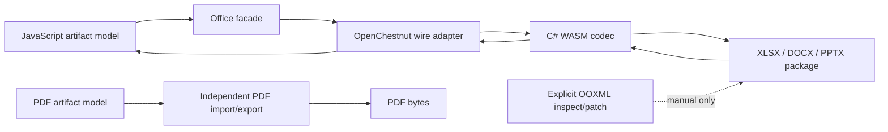

# Runtime architecture

## Decision

OpenChestnut is the only XLSX, DOCX, and PPTX codec. It is implemented in C# with the Open XML SDK and compiled into the bundled .NET WebAssembly runtime. PDF remains an independent implementation.

Version 0.2 intentionally has no Office codec registry, selector, compatibility shim, or fallback path.

## Responsibilities

### JavaScript

JavaScript owns:

- public Workbook, DocumentModel, Presentation, and PDF object models;
- formula calculation and other model-side computation;
- presentation Compose/JSX;
- validation, normalization, inspect, resolve, layout, render orchestration, and QA;
- the OpenChestnut wire adapter and generated protocol binding;
- explicit, low-level OOXML package inspect/patch helpers;
- JSZip where package inspection/patching needs it;
- the independent PDF pipeline and optional adapters.

JavaScript does not serialize or parse DOCX, XLSX, or PPTX for the normal file facades.

### OpenChestnut C# WASM

OpenChestnut owns:

- OPC package validation and safe path/relationship/content-type handling;
- DOCX, XLSX, and PPTX semantic import/export;
- source snapshot and opaque-object preservation checks;
- bounded source-bound edits;
- deterministic package generation within the supported profiles.

The implementation uses the Open XML SDK because its strongly typed package and schema model provides a broad, shared foundation across WordprocessingML, SpreadsheetML, and PresentationML. C# is not exposed as a second user model; the wire is the boundary between JavaScript artifacts and native OOXML operations.

### PDF

PDF never enters the Office codec request, has no codec selector, and does not load the C# runtime. It keeps PDF creation/import, inspect/extract, geometry, reading order, accessibility, render, and verification in its existing pipeline. PDF.js import and Poppler/Playwright rendering are optional adapters.

## Facade contract

The six Office methods are:

- `SpreadsheetFile.importXlsx(input, { limits? })`
- `SpreadsheetFile.exportXlsx(workbook, { limits?, recalculate? })`
- `DocumentFile.importDocx(input, { limits? })`
- `DocumentFile.exportDocx(document, { limits? })`
- `PresentationFile.importPptx(input, { limits? })`
- `PresentationFile.exportPptx(presentation, { limits? })`

Each method dynamically imports `codecs/open-chestnut`, then invokes the corresponding typed helper. This avoids the model/adapter static-import cycle while keeping one runtime identity.

Passing `codec`, `allowLossy`, `preferNative`, `relativeDateAsOf`, or any other unknown option throws before codec execution. A missing or invalid WASM runtime also throws; no alternate implementation is tried.

`codecs/open-chestnut` remains a public advanced boundary. `codecs/open-chestnut/wire` exposes generated messages. `codecs/openxml-wasm` is removed.

## Wire protocol 2

The namespace remains `open_office.artifact.v1`. Protocol version 2 is intentionally breaking.

- `CodecRequest.allow_lossy` was removed.
- Its field name and number are reserved and cannot be reused.
- The request contains exactly one supported artifact payload for its declared operation.
- Office export responses report `metadata.codec: "open-chestnut"` at the JavaScript boundary.
- XLSX adds basic validation, conditional-format, and one-level threaded-comment records.
- DOCX adds style/default formatting, paragraph/run formatting, section/header/footer, field, and image records.
- PPTX adds connector, chart, and basic shadow records.

New fields are added only when the existing public artifact model and wire cannot express an accepted 0.2 capability. The project does not maintain a parallel native object model.

## Opaque preservation and fail-closed edits

On import, OpenChestnut can attach:

- a bounded source package snapshot;
- normalized part paths and resolved content types;
- per-part and package hashes;
- relationship metadata;
- recognized editable-source bindings;
- opaque element/part evidence.

On export, recognized modeled edits are validated against their binding. Unmodeled content can be copied from the validated source package only while its evidence remains trustworthy. A topology-changing or unsupported semantic edit throws. If opaque content exists without a valid source snapshot, export throws. There is no opt-out switch.

Explicit OOXML inspect/patch functions are a separate low-level operation. They do not count as a fallback because the user must call them directly and the facade never routes through them.

## Runtime loading and package layout

The adapter initializes one retry-safe cached WASM runtime. It checks the bundled manifest, protocol version, assembly identity, and runtime assets before invoking the codec.

The source repository contains:

- `native/OpenChestnut` C# projects and tests;
- the public proto and generation config;
- runtime build/reproducibility scripts;
- JavaScript adapters, models, Skills, and tests.

The npm package contains:

- public JavaScript APIs and adapters;
- the proto and generated JavaScript wire binding;
- `runtime/open-chestnut` WASM/runtime assets;
- integrity manifest, SBOM, and license notices;
- the four reference Skills.

It excludes C# source/build output, repository-only scripts/tests, and removed legacy codec modules. Normal package use therefore works without a local .NET SDK.

## Verification layers

1. Protocol generation/lint and protocol-version checks.
2. C# unit tests for each codec and opaque/failure profiles.
3. JavaScript facade roundtrips and strict option rejection.
4. Documents, Spreadsheets, Presentations, and PDF Skill workflows.
5. Semantic inspect/verify and render/visual QA.
6. Open XML SDK package validation plus optional LibreOffice/native Office checks.
7. Clean-install probes with `dotnet` absent from `PATH`.
8. Deterministic WASM rebuild, package-content, SBOM, release, and hosted Linux gates.
